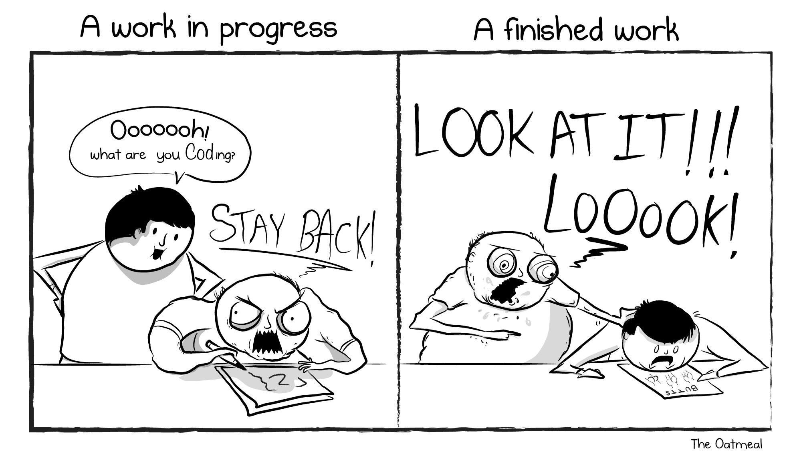
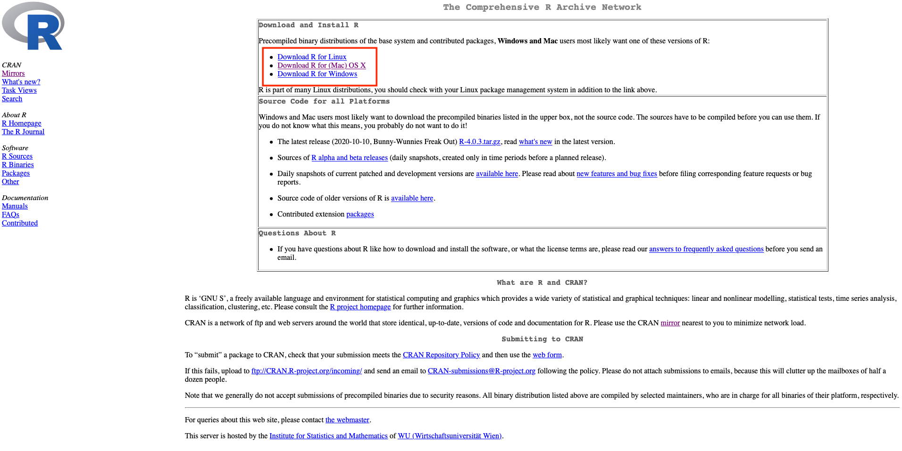
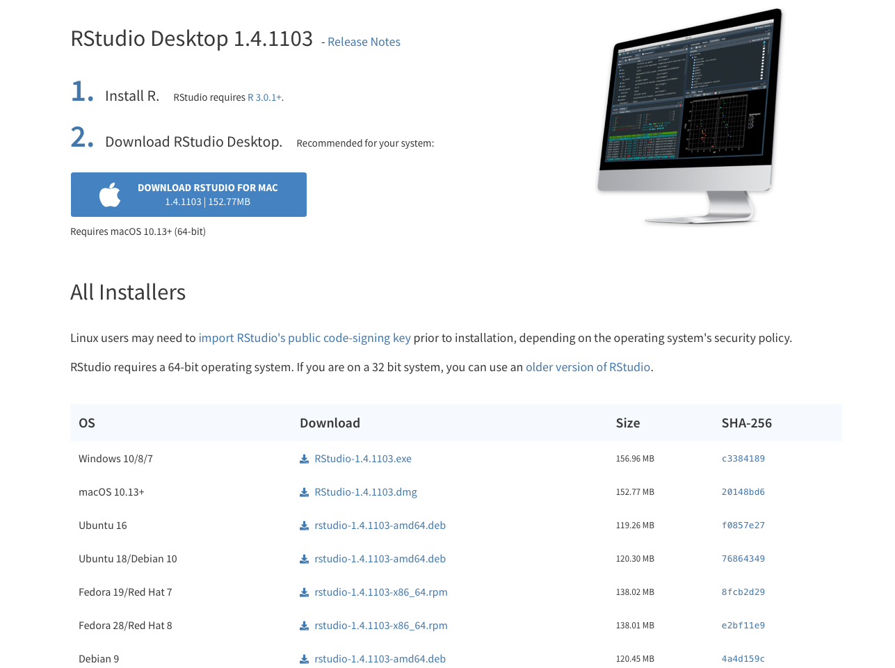
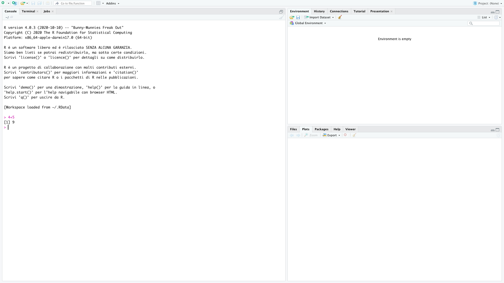
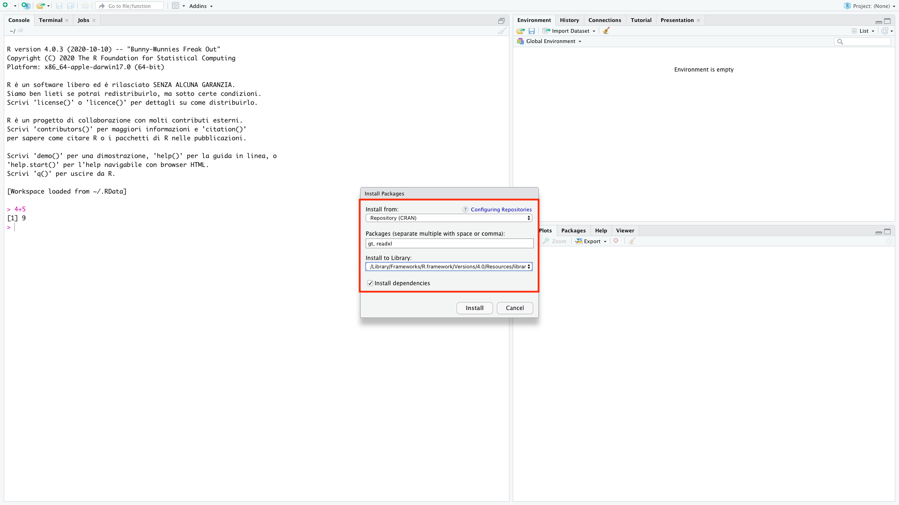
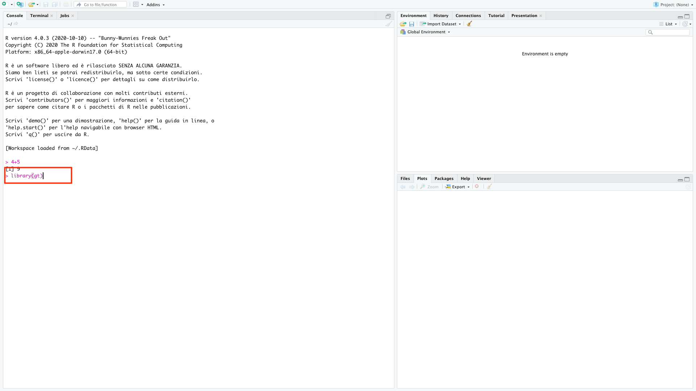
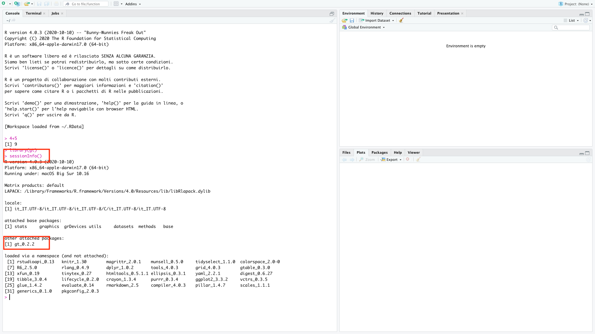

# Introduction {.unnumbered}

\justifying

> *I want to do something, not learn how to do everything.*\
> John Carroll, "Minimal manual"

Many people think of R as a statistics system. I prefer to consider it
an environment within which statistical techniques are implemented. R
can be extended (easily) via packages allowing to execute various
statistical and graphical techniques, including linear and nonlinear
modeling, classical statistical tests, spatial and time-series analysis,
classification, clustering, and others.

**If this is your first time coding**, R may be slow and tedious at the
beginning. You will pass a lot of your time trying to understand why R
is giving you an error instead of the solution to your problem. [Stack
Overflow](https://stackoverflow.com) and the R Help will become your
best friends. The software is going to seem to judge your mistakes
harshly. You will read the word "syntax error" a lot. And you will
probably grow a kind of hate for the creature that lives inside the
computer and that does not like you. You will think the creature is
value judging your code. You will crash the laptop and loose all your
data... Ok, ok! I'm a bit exaggerating... I don't want to scare you too
much, but yes, this is the worst case scenario and many of your
colleagues already passed through that, and survived!

```{r, echo=F, out.width="80%", fig.align="center", fig.show="hold"}

```

The fact is that, R is a language and, as such, should be practiced as
much as possible in order to learn it. But R is "only" a coding
language, so you will not be not able to speak *Rish* with your friends
(fortunately!) nor write a letter to your pals. The only option you have
is to practice it with your computer (also in group if you prefer). All
the syntax errors you will get do not mean that R thinks you're bad. It
is not a judgment of your ability as a statistician. Syntax errors mean
R is lost and doesn't have better words to tell you that. Beside the
fact that it can allow you to do marvelous things, R understands only
when you talk to him in his language. So, my suggestion when you get an
error is:

1.  Read out loud the error and try to make sense of where the problem
    is (usually R suggest you that).

2.  Check carefully your code, there may be a missing comma or a
    misspelled capital letter.

3.  Copy paste the error on google and look for answers. This works more
    than what you may think.

4.  [Contact me](mailto:info@federicoroscioli.com).

The above steps almost always work, but in general I want you to never
loose your effort. You will figure it out, be sure about it. You only
need to build some experience first. It is like when you learn to ride a
bicycle, at the beginning you have to fall a lot, but in the end you
will love cycling and you will never want to get off your bike.

As a final wish for you: during my first contact with R, I was "lost",
"lost", "lost", "lost", "lost", "oh wow, I love this!". And I hope that
all of you will go through that exact same feeling.

So, please, **have fun, be curious, and exercise a lot!**

---

This manual is composed by two main sections divided in chapters. The
first section will introduce the reader to the basic characteristics of
the software required, its installation and configuration, it will then
have a linguistic focus, so it aims at teaching how to use R in order to
visualize, explore, understand, manipulate and create data. It will do
so in a progressive way, starting from simple computations and ending
with complex data manipulation and plotting. The second section,
instead, will be all about applied statistics, from exploratory
analysis, to the introduction of hypothesis testing and its
implications, to bivariate and multivariate analysis methods, such as
principal component analysis and classification and regression trees.


# (PART) The R code {-}


# Installation

 

 

 

## Introductory activities

First of all we need to install the software that will allow us to work
with the R language [@rcoreteam2022]. We will need to install two
software: R and R-Studio. The first is a compiler for the R language, we
need to install it but we will never use it directly. The latter is an
interface software that runs on top of R and allows us to have some
facilitation and suggestions while working. Within this manual I will
use R and R-Studio as synonyms, but I will be referring always to the
use of R-Studio.

Additional to R and R-Studio we will need to install some packages. The
packages are extension of the software that bring in additional
functions and/or data.

To install the software, follow all the 9 steps below:

1.  Download the R installer from [CRAN](https://cran.r-project.org/).\

```{r, echo=F, out.width="80%",fig.align="center", fig.show="hold", fig.cap="Select the version of R according to your operating system."}
 
```

2.  Run the installer keeping the default settings. If you do not have admin rights on your computer, please ask you IT Support to give you full permissions to the R directories. Otherwise you will not be able to install packages afterwards.

3.  Download the R-Studio installer from [R-Studio](https://rstudio.com/products/rstudio/download/#download).\

```{r, echo=F, out.width="80%",fig.align="center", fig.show="hold", fig.cap="Select the version of R-Studio according to your operating system."}
 
```


4.  Once the installation of R is completed (NOT BEFORE), run the R-Studio installer keeping the default settings.

5.  Run R-Studio. It should open an window like the one in the image below.\

```{r, echo=F, out.width="80%",fig.align="center", fig.show="hold", fig.cap="R-Studio."}

```


6.  In the left hand window, by the sign "\>", type "4+5" (without the quotes) and hit enter. An output line reading "$[1]$ 9" should appear. This means that R and R-Studio are working properly. If this is not successful, please [contact me]([mailto:%20info\@federicoroscioli.com](mailto:%20info@federicoroscioli.com){.uri}).

7.  Go to Tools -\> Install Packages and install the packages:"gt", and "readxl". See the image below.\

```{r, echo=F, out.width="80%",fig.align="center", fig.show="hold"}

```


8.  Check that the packages are installed by typing "library(gt)" (without the quotes) in the prompt and press enter.\

```{r, echo=F, out.width="80%",fig.align="center", fig.show="hold"}

```


9.  Finally type "sessioninfo()" (without the quotes) and check that gt has been installed.\

```{r, echo=F, out.width="80%",fig.align="center", fig.show="hold"}

```

 

 

 

 

## Visualization suggestions

Following some visualization suggestions that you may explore.
Personally, I find them really helpful.

-   Setting the work-space:

    -   View -\> Panes -\> Panes Layout\
    -   clockwise from top-left you should have: Source, Environment,
        Files, Console

-   Setting the color style of the code:

    -   Tools \> Global Options -\> Appearance -\> Editor Theme -\>
        Xcode

 

 

 

 

## The workspace

```{r, echo=F, out.width="80%",fig.align="center", fig.show="hold"}
knitr::include_graphics("images/workspace.png")
```

The **source** is a text file with extension .R that can be saved and
opened from every version of R and R-Studio. This file will allow us to
run and rerun a bunch of code, modify some details if we made a mistake
or if we want to change something. This will always be our best friend.

The **Environment** is the place where R saves temporarily all the data
that we tell "him" to save. The environment will never be clean or
contain only the essential objects you need (maybe this will happen when
you will be a great programmer, but not for now). We will see there all
your data-sets, variables, vectors, etc...

The bottom right part of the screen is devoted to many things.
**Viewer**, **Plots** and **Help** will be activated automatically to
show you the requested output. **Packages**, instead, is useful only
when we have to install new packages.

The **Console** is where we can write some code that will not be saved,
if not in the temporary history of the console itself. This space is
also where R give us the feedback of our inputs in the form of results,
warnings and errors.

\newpage

