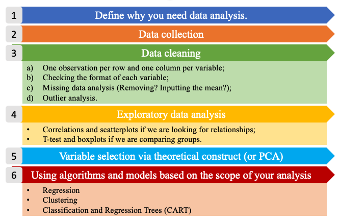
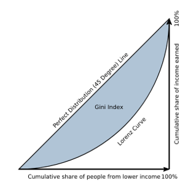

# (PART) Section 2 - Statistical Analysis {-} 

 

 

# Exploratory Data Analysis

\justifying

From this point forward, we will stop focusing on R, and we will finally
start acting as statisticians. We will perform various level of data
analysis by applying different methodologies. Of course, R will be our
tool, our facilitator, but it will be no more at the center of the
stage. We will fully concentrate on the statistical methods, their
application and interpretation.

Following the six steps of data analysis. This section explores the
steps from 4 to 6, given that the first two are out of the scope of this
book and the third has been treated in the previous section.

```{r, echo=F, out.width=600, fig.show="hold", fig.cap="The six steps of data analysis."}

```


Exploratory data analysis is usually performed when we have our first
contact with [clean]{.underline} new data. Of course, the first
impression is not always the right one, but if we give it a proper
chance can save us a lot of work and some headaches later on. During
this phase we will perform some summary statistics (central tendency and
variability measures), basic plotting, inequality measures, and
correlations. Exploratory analysis differs from the [dataset
exploration] we performed in Chapter 1, because the latter focuses on
the shape of the data (type, dimensions, etc) while the former focuses
on the content.

 

 

 

## Central Tendency Measures

A measure of central tendency is a single value that attempts to
describe a set of data by identifying the central position within that
set of data. The mean, median and mode are all valid measures of central
tendency, but under different conditions, some measures of central
tendency become more appropriate to use than others [@lane2003;
@manikandan2011; @laerdstatistics].

------------------------------------------------------------------------

The **arithmetic** **mean** (or **average**) is the most popular and
well known measure of central tendency. The mean is equal to the sum of
all values divided by the number of observations (Equation
\@ref(eq:mean)).

\begin{equation}
\bar x = \frac{\sum{x}}{n}
(\#eq:mean)
\end{equation}
 
One of its important properties is that it minimizes error in the
prediction of any value in your data set, given a big enough sample size
(more details on this property will be discussed in [The Normal
Distribution] chapter). Another important property of the mean is that
it includes every value in your data set as part of the calculation.
This implies, also, that it is sensitive to the presence of outliers or
skewed distributions (i.e., the frequency distribution for our data is
skewed). In those cases the median would be a better indicator of
central location.

------------------------------------------------------------------------

The **geometric mean** is defined as the $n^{th}$ root of the product of
$n$ values (Equation \@ref(eq:geomean)).


\begin{equation}
\bar x_{g} = \sqrt[n^{th}]{x_1*x_2*...*x_n}
(\#eq:geomean)
\end{equation}

The geometric mean cannot be used if the values considered are lower
or equal to zero. It is often used for a set of numbers whose values are
meant to be multiplied together or are exponential in nature, such as a
set of growth figures: values of the human population, or interest rates
of a financial investment over time.

------------------------------------------------------------------------

The **median** is the middle score for a set of data that has been
arranged in order of magnitude. This means, also, that the median is
equal to the value corresponding to the 50th percentile of he
distribution. If the number of observations is even, then the median is
the simple average of the middle two numbers.

------------------------------------------------------------------------

The **mode** is the most frequent score in our data set. On a histogram
it represents the highest point (we will see more about it later in this
chapter). You can, therefore, sometimes consider the mode as being the
most popular option. This implies that the mode is not always a unique
value, in fact (particularly in continuous data) we can have bi-modal,
tri-modal, or multi-modal distributions. Moreover, the mode will not
provide us with a very good measure of central tendency when the most
common mark is far away from the rest of the data.

------------------------------------------------------------------------

The **middle value** is a less used measure. It represents the value
exactly at the center between the minimum and the maximum values
(Equation \@ref(eq:mv)), regardless of the distribution of the data Thus it is
sensitive to outliers.


\begin{equation}
\frac{max-min}{2}
(\#eq:mv)
\end{equation}


------------------------------------------------------------------------

The function `summary()` gives us a brief overview of the minimum,
maximum, first and third quantile, median and mean of each variable, or
of a single variable. Of course these measures can be also computed
independently using dedicated functions.

The following code computes summary statistics, arithmetic mean,
geometric mean (there is not a dedicated function for it), median, mode
(the function from `DescTools` allows us to retrieve also multi-modal
values)[@signorelli2021], and middle value. For more options about all
the functions below, please, look in the help.

```{r, eval=F}
# to do statistical summaries of the whole dataset or of a single variable
summary(mtcars)
summary(mtcars$cyl)

# arithmetic mean
mean(mtcars$mpg)

# geometric mean
exp(mean(log(mtcars$mpg)))  

# median
median(mtcars$mpg)

# mode
library(DescTools)
Mode(mtcars$mpg)

#middle value
(max(mtcars$mpg)-min(mtcars$mpg))/2
```

 

 

 

## Variability Measures

The terms variability, spread, and dispersion are synonyms, and refer to
how disperse a distribution is. These measures complete the information
given by central tendency measures, in order to better understand the
data we are analyzing. The example below gives us an idea of how unequal
distributions may have the same central tendency measures, and thus,
considering only them would lead to mistaken evaluations.

```{r, echo=F, out.width=c('50%', '50%'), fig.show='hold', fig.cap="From left: Histograms of the samples a and b."}
a <- c(1, 2, 3, 3, 5, 4)
b <- c(2, 3, 3, 3, 3, 4)
hist(a)
hist(b)

library(DescTools)
library(pander)
pander(data.frame(distributions = c("a", "b"),
           mean = c(mean(a), mean(b)),
           median = c(median(a), median(b)),
           mode = c(Mode(a)[1], Mode(b)[1])
           ), caption = "Central tendency measures of the samples a and b.")
```

------------------------------------------------------------------------

The **range** is the simplest measure of variability to calculate, and
one you have probably encountered many times in your life. The range is
the maximum value minus the minimum value (Equation \@ref(eq:range)). 

\begin{equation}
range=max-min
(\#eq:range)
\end{equation}


------------------------------------------------------------------------

The **interquartile range** (IQR) is the range of the central 50% of the
values in a distribution (Equation \@ref(eq:iqrange)).


\begin{equation}
IQR=75^{th} percentile - 25^{th} percentile
(\#eq:iqrange)
\end{equation}


------------------------------------------------------------------------

But variability can also be defined in terms of how close the values in
the distribution are to the middle of the distribution. Using the mean
as the measure for referencing to the middle of the distribution, the
**variance** is defined as the average squared difference of the scores
from the mean (Equation \@ref(eq:var)).


\begin{equation}
\sigma^2=\frac{\sum{(X-\bar x)^2}}{N}
(\#eq:var)
\end{equation}


------------------------------------------------------------------------

The **standard deviation** is simply the square root of the variance
(Equation \@ref(eq:sd)). It is an especially useful measure of variability when
the distribution is normal or approximately normal (see [The Normal
Distribution]) because the proportion of the distribution within a given
number of standard deviations from the mean can be calculated.


\begin{equation}
\sigma=\sqrt{\sigma^2}
(\#eq:sd)
\end{equation}


------------------------------------------------------------------------

The **coefficient of variation** (CV) represents the ratio of the
standard deviation to the mean (Equation \@ref(eq:cv)), and it is a useful
statistic for comparing the degree of variation of data relative to
different unit of measures. In fact, the CV is the only variability
measure (of those mentioned here) that is standardized, thus does not
depend on its unit of measure.


\begin{equation}
CV=\frac{\sigma}{\bar{x}}
(\#eq:cv)
\end{equation}


------------------------------------------------------------------------

The following code computes the above mentioned variability measures for
the consumption variable of the mtcars dataset. In the last lines you
can find also the code to compile a frequency table with the function
`table()`.

```{r, eval=F}
# range
max(mtcars$mpg) - min(mtcars$mpg)

# quantile distribution
quantile(mtcars$mpg)

# interquantile range
quantile(mtcars$mpg, probs = .75) - quantile(mtcars$mpg, probs = .25)

# variance
var(mtcars$mpg)

# standard deviation
sd(mtcars$mpg)

# coefficent of variation
sd(mtcars$mpg)/mean(mtcars$mpg)

# frequency tables
table(mtcars$cyl)
table(mtcars$cyl, mtcars$am)
```

Below a simple code that allows to create a dataframe, which is also a
way to create a summary table. The `data.frame()` function has to be
filled column wise, specifying the column/variable name and then the
content. You can play with it in order to create a personalized table.
The `stargazer()` function, instead presents the same statistics as the
`summary()` function, but in a cooler style [@torres-reyna2014;
@hlavac2022].

```{r, eval=F}
# create a table storing your values
data.frame(obs = c("Miles per Gallon", "Number of Cylinders"),
           mean = c(mean(mtcars$mpg), mean(mtcars$cyl)),
           median = c(median(mtcars$mpg), median(mtcars$cyl)),
           sd = c(sd(mtcars$mpg), sd(mtcars$cyl))
           )

# create a table storing basic summary statistics
library(stargazer)
stargazer(mtcars, type = "text", digits=2)
```

 

 

 

## Inequality Measures

Another set of analysis methods that are related to variability are
inequality measures. Inequality can be defined as: "a scalar numerical
representation of the interpersonal differences in income (for example)
within a given population." The use of the word "scalar" implies that
all the different features of inequality are compressed into a single
number or a single point on a scale.

But inequality of what? The strict statistical rule says that it must be
a quantitative variable transferable among the population of interest,
such as income, apples, cars, etc... However, in economics, inequality
measurements are used also for other items, like carbon emissions.

------------------------------------------------------------------------

The **Gini** coefficient, or Gini Index, is the most widely used measure
of inequality in policy-related discussions. It is a measure of
statistical dispersion most prominently used as a measure of inequality
of income distribution or inequality of wealth distribution. It is
defined as a ratio with values between 0 and 1. Thus, a low Gini
coefficient indicates more equal income or wealth distribution, while a
high Gini coefficient indicates more unequal distribution. Zero
corresponds to perfect equality (everyone having exactly the same
income) and 1 corresponds to perfect inequality (where one person has
all the income, while everyone else has zero income). *Note that the
Gini coefficient requires that no one have a negative net income or
wealth.*

In geometrical terms, the Gini coefficient can be thought of as the
ratio of the area that lies between the line of perfect equality (the
diagonal) and the Lorenz curve over the total area under the line of
equality (see Figure 7). Here the formula used to compute the Gini
coefficient:


\begin{equation}
G(x)=1-\frac{2}{N-1}\sum^{N-1}_{i=1}{q_i}
(\#eq:gini)
\end{equation}


where *N* is the population size, and *q* is the cumulative relative
income.

```{r, echo=F, out.width=180, fig.show="hold", fig.cap="Graphical representation of the Gini index."}

```

Run the code below and calculate the Gini coefficient for both the x and
y objects. You can either use the function from the package `DescTools`
[@signorelli2021], or the function from the package `labstatR`
[@iacus2020] (remember that R is case-sensitive!). Did you expect this
value of Gini?

Try to understand how the function `rep()` works using the help.

```{r, eval=F}
# generate vector (of incomes)
x <- c(541, 1463, 2445, 3438, 4437, 5401, 6392, 8304, 11904, 22261)
y <- c(rep(1000, 10))
z <- c(541, 1463, 2445, 3438, 3438, 3438, 3438, 3438, 11904, 22261)

# compute Gini coefficient
library(DescTools)
Gini(x)
Gini(y)
Gini(z)
# or
library(labstatR)
gini(x)
```

As mentioned, the Gini Index is nowadays a recognized standard,
nevertheless it has some limitations. In fact, Gini is more sensitive to
changes in the middle of the distribution, than to the tails. In
economics, when we study inequality, we are often more interested in the
tails behavior (namely the top and bottom 10% of the distribution).

------------------------------------------------------------------------

The **Palma Ratio** is a particular specification within a family of
inequality measures known as inter-decile ratios [@cobham2016]. More
specifically, it is the ratio of national income shares of the top 10%
of households to the bottom 40%. It, thus, tells us how many times the
income of the top 10% of the population is higher than that of the
bottom 40% (Equation \@ref(eq:palma)).


\begin{equation}
Palma = \frac {top10}{bottom40}
(\#eq:palma)
\end{equation}


The code below computes the Palma Ratio for the $x$ and $z$
distributions created previously. This has to be done manually, by
computing the top 10% income and the bottom 40% income with the
cumulative frequencies computed by the function `gini()` of the package
`labstatR` [@iacus2020]. Confront the Gini Index and the Palma Ratio, do
you find different results? Why?

```{r, eval=F}
library(labstatR)
# extracting the cumulative frequencies from the function gini by labstatR
q <- gini(x)$Q

# computing the Palma Ratio on the cumulative frequencies
(quantile(q, probs = 1, type=3)-quantile(q, probs = .9, type=3))/
  quantile(q, probs = .4, type=3)

# extracting the cumulative frequencies from the function gini by labstatR
q2 <- gini(y)$Q

# computing the Palma Ratio on the cumulative frequencies
(quantile(q2, probs = 1, type=3)-quantile(q2, probs = .9, type=3))/
  quantile(q2, probs = .4, type=3)

# extracting the cumulative frequencies from the function gini by labstatR
q3 <- gini(z)$Q

# computing the Palma Ratio on the cumulative frequencies
(quantile(q3, probs = 1, type=3)-quantile(q3, probs = .9, type=3))/
  quantile(q3, probs = .4, type=3)
```

 

 

 

## Data visualization

Visualizing data is another way to explore the data, or better, a
complement to the quantitative exploratory analysis carried out above.
In fact, as we saw in the example in Figure 6, a simple histogram can
tell us whether the arithmetic mean can give us a realistic
representation of the data, or if more analysis is needed. In this
section we will not see the beautiful graphs for which R is recognized
worldwide (for those I invite you to explore [Ggplot2]), but fast and
dirty graphs have their potential too, at least for the exploratory
analysis phase.

------------------------------------------------------------------------

A **histogram** is a plot that allows the inspection of the data for its
underlying distribution (e.g., normal distribution), outliers, skewness,
etc. If the bars of the histogram are equally spaced bars, the height of
the bin reflects the frequency of each value of the distribution.

------------------------------------------------------------------------

A **box plot**, also called a "box and whisker plot", is a way to show
the spread and centers of a data set. A box plot is a way to show a five
number summary in a chart. The main part of the chart (the "box") shows
where the middle portion of the data is: the interquartile range. At the
ends of the box, you" find the first quartile (the 25% mark) and the
third quartile (the 75% mark). The far bottom of the chart is the
minimum (the smallest number in the set) and the far top is the maximum
(the largest number in the set). Finally, the median
[(]{.underline}**not the mean!**[)]{.underline} is represented by an
horizontal bar in the center of the box.

------------------------------------------------------------------------

A **scatter plot** is a bi-dimensional plot in which the dots represent
values for two different numeric variables in the Cartesian space. The
position of each dot indicates each individual data point with respect
to the two variables selected. Scatter plots are used to observe
relationships between two numeric variables (we will deepen their use
later in this chapter).

```{r fig1, echo=F, out.width=c('50%', '50%'), fig.show='hold', fig.cap="Plot examples. From top-left clowise: Histogram; Density plot; Scatterplot; Boxplot."}
# histogram and density plot
hist(mtcars$mpg)
plot(density(mtcars$mpg))

# scatterplot
plot(mtcars$hp,
     mtcars$mpg,
     ylab = "Miles per Gallon",
     xlab = "Horse Power",
     main = "Is consumption related to Horse Power?")
abline(lm(mpg ~ hp, data = mtcars), col = "blue")

# creating our data for further analysis
# subset automatic cars consumption
mpg.at <- mtcars$mpg[mtcars$am == 0]
# and manual cars consumption
mpg.mt <- mtcars$mpg[mtcars$am == 1]

# boxplot
boxplot(mpg.mt, mpg.at)
```

The code provided for this part may look a bit more complex than what we
have seen so far. We first draw an histogram and a density plot (which
is a linear representation of the same distribution). Then, we draw some
scatter plots, we add some "stilish" (but still basic) arguments and a
linear regression line. Note that the formula used in the `abline()`
function is something that we will explore better in [Linear
Regression], for now only notice that `y ~ x + z + e` stands for
`y = x + z + e` in a classic linear expression algebra.[^5] We then
subset consumption (mpg) data for automatic and manual cars from the
`mtcars` dataset in order to study the differences among them with a box
plot. We can see how manual cars (1 in the plot) present higher miles
per gallon (thus lower consumption) than automatic cars (0 in the plot),
and the two distributions overlaps only on their tails. In the following
graph, we appreciate how a continuous variable (horse power) is
distributed among cars grouped by a discrete variable (cylinders). In
this way, we are studying a relationship between variable of mixed
types. Note that, in order to tell R that the variable is discrete, we
used the function `as.factor()` (more details on it in [Factor
variables]). Moreover, we specified the $x$ and $y$ axes labels using
the `xlab` and `ylab` arguments.

[^5]: In order to type the symbol \~ (tilde) it is needed a different
    combination of keys according to the operating system and the
    keyboards.

Try the code, personalize it, and check in the help for supplementary
options.

```{r eval=F}
# histogram
hist(mtcars$mpg)

# density plot
plot(density(mtcars$mpg), type = "l")

# scatterplot of cyl vs hp
plot(mtcars$cyl, mtcars$hp)

# why do we get an error here?
plot(mpg, hp)

# stylish scatterplot
plot(mtcars$hp,
     mtcars$mpg,
     # adding titles and axes names
     ylab = "Miles per Gallon",
     xlab = "Horse Power",
     main = "Is consumption related to Horse Power?")

# adding a regression line on the scatterplot
abline(lm(mpg ~ hp, data = mtcars), col = "blue")

# subset automatic cars consumption
mpg.at <- mtcars$mpg[mtcars$am == 0]
# and manual cars consumption
mpg.mt <- mtcars$mpg[mtcars$am == 1]

# boxplot
boxplot(mpg.mt, mpg.at)

# boxplot with a categorical variable
plot(as.factor(mtcars$cyl), mtcars$hp, 
     # adding axes names
     xlab="Cylinders", ylab="Horse Power")

```

 

 

 

## Scaling data

Scaling, or standardizing, data is a useful technical trick that
statisticians and economists use in order to better use data. Some of
the most common situations where scaling is required are visualization,
interpretation, but most of all comparison.

------------------------------------------------------------------------

**Log scaling** is typically used for plotting and regression analysis.
It is a way of displaying numerical data over a very wide range of
values in a compact way. In fact, typically, when log scaling is needed,
the largest numbers in the data are hundreds or even thousands of times
larger than the smallest numbers. As an example, often exponential
growth curves are displayed on a log scale, otherwise they would
increase too quickly to fit within a small graph and allow a complete
analysis of its variation. R has the function `log()`to do that.

```{r, eval=F}
# creating data
x = c(5,100,4000,7,1000,350000,25000)

# plotting data
plot(x)

# log scaling
scaled_x <- log(x)

# plotting scaled data
plot(log(scaled_x))
```

------------------------------------------------------------------------

**Ranking** replaces the value assumed by each unit, with the order
number (rank) by which the unit is placed on the list according to a
specific indicator. If two or more units assume the same value, then
they will give the average rank of the positions that they would have
had in case of different values. The transformation into ranks purifies
the indicators from the unit of measure, but it does not preserve the
relative distance between the different units.

The basic form of the `rank()` function produces a vector that contains
the rank of the values in the vector that was evaluated such that the
lowest value would have a rank of 1 and the second-lowest value would
have a rank of 2.

```{r, eval=F}
# creating data
x = c(5,1,4,7,10,35,25)

# scale ranking data
scaled_x <- rank(x)
```

------------------------------------------------------------------------

Relative indices with respect to the range (**Min-Max**) purifies the
data from their unit of measure such that the features are within a
specific range (i.e. $0, 1$)(Equation \@ref(eq:MM)). Min-Max scaling is important when we want
to retain the distance between the data points.


\begin{equation}
r_{ij}=\frac{x_{ij}-\min_ix_{ij}}{\max_ix_{ij}-\min_ix_{ij}}
(\#eq:MM)
\end{equation}


```{r, eval=F}
# creating data
x = c(5,1,4,7,10,35,25)

# min-max scaling data
scaled_x <- (x-min(x))/(max(x)-min(x))
```

------------------------------------------------------------------------

The point of **z-score standardization** is to change your data so that
it can be described as a normal distribution (Equation \@ref(eq:zscore)). Normal distribution, or
Gaussian distribution, is a specific statistical distribution where
equal observations fall above and below the mean, the mean and the
median are the same, and there are more observations closer to the mean
(for more details see [The Normal Distribution]).


\begin{equation}
z_{ij}=\frac{x_{ij}-\bar x_j}{\sigma_j}
(\#eq:zscore)
\end{equation}


The `scale()` function, with default settings, will calculate the mean
and standard deviation of the entire vector, then normalize each element
by those values by subtracting the mean and dividing by the standard
deviation (equation 5.6). The resulting distribution will have mean
equal to 0 and standard deviation equal to 1.

```{r, eval=F}
# creating data
x = c(5,1,4,7,10,35,25)

# z-score scaling data
scaled_x <- scale(x)
mean(scaled_x)
sd(scaled_x)
```

------------------------------------------------------------------------

In **index numbers**, the value assumed by each unit is divided by a
reference value belonging to the same distribution or calculated on it
(generally the mean or maximum)(Equation \@ref(eq:in)). This normalization allows
to delete the unit of measure and to keep the relative distance among
the units. If the denominator is the maximum than we obtain values less
or equal to 100.


\begin{equation}
I_{ij}=\frac{x_{ij}}{x^*_{oj}}*100
(\#eq:in)
\end{equation}


```{r, eval=F}
# creating data
x = c(5,1,4,7,10,35,25)

# indexing with mean
scaled_x <- x/mean(x)

# indexing with maximum
scaled_x <- x/max(x)
```

------------------------------------------------------------------------

In the **percentage** transformation the value of each unit is divided
by the sum of the values (Equation \@ref(eq:perc)). The sum of the normalized
values are equal to 100.


\begin{equation}
p_{ij}=\frac{x_{ij}}{\sum^n_{i=1}x_{ij}}*100
(\#eq:perc)
\end{equation}


```{r, eval=F}
# creating data
x = c(5,1,4,7,10,35,25)

# percentage indexing
scaled_x <- x/sum(x)
```

 

 

 

## Probability Sampling

Sampling allows statisticians to draw conclusions about a whole by
examining a part. It enables us to estimate characteristics of a
population by directly observing a portion of the entire population.
Researchers are not interested in the sample itself, but in what can be
learned from the survey---and how this information can be applied to the
entire population.

------------------------------------------------------------------------

**Simple Random sampling** is a powerful tool, we can use it to random
subset data, or generate random distributions with precise
characteristics. Each member of a population has an equal chance of
being included in the sample. Also, each combination of members of the
population has an equal chance of composing the sample. Those two
properties are what defines simple random sampling. Simple random
sampling can be done *with or without replacement*. A sample with
replacement means that there is a possibility that the sampled
observation may be selected twice or more. Usually, the simple random
sampling approach is conducted without replacement because it is more
convenient and gives more precise results.

Simple random sampling is the easiest method of sampling and it is the
most commonly used. Advantages of this technique are that it does not
require any additional information on the sampled unit, nor on the
context (i.e. the geographic area, gender, age, etc...). Also, since
simple random sampling is a simple method and the theory behind it is
well established, standard formulas exist to determine the sample size,
the estimates and so on, and these formulas are easy to use.

On the other hand, by making no use of context information this method
may sometimes result less efficient in equally representing some strata
of the population, particularly for smaller samples. Finally, if we are
planning a survey and not just sampling already collected data, simple
random sampling may result an expensive and unfeasible method for large
populations because all elements must be identified and labeled prior to
sampling. It can also be expensive if personal interviewers are required
since the sample may be geographically spread out across the population.

We can calculate the probability of a given observation being selected.
Since we know the sample size ($n$) and the total population ($N$),
calculating the probability of being included in the sample becomes a
simple matter of division (Equation \@ref(eq:srs)).


\begin{equation}
p=\frac{n}{N}*100
(\#eq:srs)
\end{equation}


In R we will use the `sample()` function. This function requires us to
specify the total population to be sampled (i.e. a vector between 1 and
1 million), comma, the sample size we are interested in, comma, if we
want replacement to happen (`TRUE`) or not (`FALSE`).

In order to have a reproducible code (this is one of the main reasons
for using R as our working tools), we want to be able to select the same
random sample over and over. It may sound complex, but it is not. If we
are not able to select the same random sample today and tomorrow, our
analysis will change slightly every time we run the code. In order to
solve this problem, we will use the `set.seed()` function at the
beginning of our work. In fact by setting the seed, we tell R which set
of random number generator to use. **Please be aware that different
versions of the Random Number Generator will select different samples
given the same seed. If you collaborate with other people, specify the
same version of it** (see the code below)**.**

In the code below, run the first line multiple times and you will see
different samples drawn. If instead, you run the set.seed line plus the
sampling, you will have always the same sample. The last line of code,
gives us an example of how to randomly select 4 rows out of the mtcars
dataset (32 rows) using a combination of the indexing system and the
`sample()` function. In fact, between square brackets there are: a
vector of row numbers (generated by the `sample()` function), comma
nothing (which means that we want to keep all the columns of the
dataset). You can run just the sample function first to see the
resulting vector (`sample(1:32, 4, replace=FALSE)`), after this run the
whole line (`samp_data <- mtcars[sample(1:32, 4, replace=FALSE),]`). The
code subsets the mtcars lines randomly sampled.

```{r, eval=F}
# random sampling 4 numbers out of the series from 1 to 32
sample(1:32, 4, replace=FALSE)

# set seed allows us to reproduce the random operations we do locally
set.seed(1234)
sample(1:32, 4, replace=FALSE)

# specifying the Random Number Generator version, allows everyone to have the same sample. 
set.seed(123, kind = "Mersenne-Twister", normal.kind =  "Inversion")

# sampling the random observations selected
set.seed(1234)
samp_data <- mtcars[sample(1:32, 4, replace=FALSE),]
```

------------------------------------------------------------------------

In **stratified sampling**, the population is divided into homogeneous,
mutually exclusive groups called strata, and then independent samples
are selected from each stratum. Why do we need to create strata? There
are many reasons, the main one being that it can make the sampling
strategy more efficient. In fact, it was mentioned earlier that we need
a larger sample to get a more accurate estimation of a characteristic
that varies greatly from one unit to the other than for a characteristic
that does not. For example, if every person in a population had the same
salary, then a sample of one individual would be enough to get a precise
estimate of the average salary.

This is the idea behind the efficiency gain obtained with
stratification. If we create strata within which units share similar
characteristics (e.g., income) and are considerably different from units
in other strata (e.g., occupation, type of dwelling) then we would only
need a small sample from each stratum to get a precise estimate of total
income for that stratum. Then we could combine these estimates to get a
precise estimate of total income for the whole population. If we were to
use a simple random sampling approach in the whole population without
stratification, the sample would need to be larger than the total of all
stratum samples to get an estimate of total income with the same level
of precision.

Any of the sampling methods mentioned in this section (and others that
exist) can be used to sample within each stratum. The sampling method
and size can vary from one stratum to another, since each stratum
becomes an independent population. When simple random sampling is used
to select the sample within each stratum, the sample design is called
**stratified simple random sampling**. A population can be stratified by
any variable that is available for all units on the sampling frame prior
to sampling (i.e., age, gender, province of residence, income, etc.).

The code below applies a Stratified Simple Random Sampling to the Star
Wars dataset. Using the `Dplyr` package [@wickham2022], we are able to
stratify the data by one variable (eye color), and sample randomly 40%
of the available population in each stratum (function `sample_frac()`),
or 2 observations per stratum (function `sample_n()`).

```{r, eval=F}
# loading the package and data
library(dplyr)

starwars %>%
        # stratifying by eye color
        group_by(gender) %>%
        # setting the sample size
        sample_frac(.4) %>%
        ungroup

starwars %>%
        # stratifying by eye color
        group_by(gender) %>%
        # setting the sample size
        sample_n(2) %>%
        ungroup
```

 

 

 

## Exercises

-   [R playground](https://federicoroscioli.shinyapps.io/exercises/),
    Exploratory data analysis

\newpage

