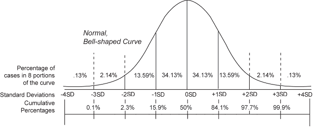
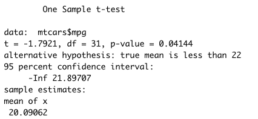
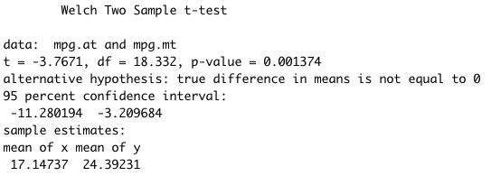

# Hypothesis Testing

Hypothesis testing is a vital process in inferential statistics where
the goal is to use **sample data** to draw conclusions about an entire
population. A hypothesis test evaluates two mutually exclusive
statements about a population to determine which statement is best
supported by the sample data. These two statements are called the null
hypothesis and the alternative hypothesis.

Why do we need a test? As mentioned, almost always in statistics, we are
dealing with a sample instead of the full population. There are huge
benefits when working with samples because it is usually impossible to
collect data from an entire population. However, the trade off for
working with a manageable sample is that we need to account for the
**sampling error**. The sampling error is the gap between the sample
statistic and the population parameter. Unfortunately, the value of the
population parameter is not only unknown but usually unknowable.
**Hypothesis tests provide a rigorous statistical framework to draw
conclusions about an entire population based on a representative
sample.**

As an example, given a sample mean of 350USD and a hypothetical
population mean of 300USD, we can estimate how much is the probability
that the population mean of 300USD is true (**p-value**), thus the
sampling error, by using the **T distribution** (which is similar to the
Normal Distribution, but with fattier tails). We will follow these four
steps:

1.  First, we define the null ($\bar i_n = \bar i_N$) and alternative
    hypotheses ($\bar i_n \neq \bar i_N$). Much of the emphasis in
    classical statistics focuses on testing a single **null
    hypothesis**, such as *H~0~:* *the average income between two groups
    is the same*. Of course, we would probably like to discover that
    there is a difference between the average income in the two groups.
    But for reasons that will become clear, we construct a null
    hypothesis corresponding to **no difference**.
2.  Next, we construct a test statistic that summarizes the strength of
    evidence against the null hypothesis.
3.  We then compute a **p-value** that quantifies the probability of
    having obtained a comparable or more extreme value of the test
    statistic under the $H_0$ [@lee2019].
4.  Finally, based on a predefined significance level that we want to
    reach (**alpha**), we will decide whether to reject or not $H_0$
    that the population mean is 300.

Hypothesis tests are not 100% accurate because they use a random sample
to draw conclusions about entire populations. When we perform a
hypothesis test, there are two types of errors related to drawing an
incorrect conclusion.

-   Type I error: rejects a null hypothesis that is true (a false
    positive).

-   Type II error: fails to reject a null hypothesis that is false (a
    false negative).

A **significance level**, also known as alpha, is an evidentiary
standard that a researcher sets before the study. It defines how
strongly the sample evidence must contradict the null hypothesis before
we can reject the null hypothesis for the entire population. The
strength of the evidence is defined by the probability of rejecting a
null hypothesis that is true [@frost]. In other words, it is the
probability that you say there is an effect when there is no effect. In
practical terms, $alpha=1-pvalue$. For instance, a p-value lower than
0.05 signifies 95% chances of detecting a difference between the two
values. Higher significance levels require stronger sample evidence to
be able to reject the null hypothesis. For example, to be statistically
significant at the 0.01 requires more substantial evidences than the
0.05 significance level.

As mentioned, the significance level is set by the researcher. However
there are some standard values that are conventionally applied in
different scientific context, and we will follow these conventions.

| $\alpha$ | $p-value$ | symbol | scientific field |
|----------|-----------|--------|------------------|
| 80%      | \<0.2     |        | social science   |
| 90%      | \<0.1     | \*     | social science   |
| 95%      | \<0.05    | \*\*   | all              |
| 99%      | \<0.01    | \*\*\* | all              |
| 99.9%    | \<0.001   |        | physics          |

: Significal levels by convention

Following we will see different type of tests, and their implementation
using R. My suggestion, when working with really small numbers (such as
the p-values), is to suppress the scientific notation in order to have a
clearer sense of the coefficient scale. Use the following code.

```{r, eval=F}
#suppress scientific notation
options(scipen = 9999)
```

 

 
 

## Probability Distributions

All **probability distributions** can be classified as discrete
probability distributions or as continuous probability distributions,
depending on whether they define probabilities associated with discrete
variables or continuous variables. With a discrete probability
distribution, each possible value of the discrete random variable can be
associated with a non-zero probability. Two of the most famous
distributions associated with categorical data are the Binomial and the
Poisson Distributions.

If a random variable is a continuous variable, its probability
distribution is called a continuous probability distribution. This
distribution differs from a discrete probability distribution because
the probability that a continuous random variable will assume a
particular value is zero, and the function that shows the density of the
values of our data is called Probability Density Function, sometimes
abbreviated pdf. Basically, this function represents the outline of the
histogram. The probability that a random variable assumes a value
between $a$ and $b$ is equal to the area under the density function
bounded by $a$ and $b$ [@damodaran].

```{r, echo=F, out.width=c('50%', '50%'), fig.show='hold', fig.cap="From left: A density distribution as outline of the hisogram; The probability that the random variable $X$ is higher than or equal to 1.5.", message=F, error=F, warning=F}
library(ggplot2)

ggplot()+
        geom_histogram(aes(x=rnorm(10000), y=..density..),
                       colour="black", fill="white")+
        geom_density(aes(rnorm(10000)), alpha=.2, fill="#FF6666")+
        theme_bw() +
        labs(title=NULL,
             x="values",
             y="density")

dnorm_limit <- function(x) {
    y <- dnorm(x)
    y[x < 1.5] <- NA
    return(y)
}

ggplot(data.frame(x = c(-3, 3)), aes(x = x))+
        stat_function(fun = dnorm_limit, geom = "area", fill = "blue",  alpha = 0.2)+
        stat_function(fun = dnorm)+
        theme_bw() +
        scale_x_continuous(breaks = seq(-3,3, .5))+
        labs(title=NULL,
             x="values",
             y="density")
```

In Figure 9, the shaded area in the graph represents the probability
that the random variable $X$ is higher than or equal to $1.5$. This is a
cumulative probability, also called **p-value** (please, remember this
definition, as this will be key in order to understand all the remaining
of this chapter). However, the probability that $X$ is exactly equal to
$1.5$ would be zero.

---

The **normal distribution**, also known as the Gaussian distribution, is
the most important probability distribution in statistics for
independent, continuous, random variables. Most people recognize its
familiar bell-shaped curve in statistical reports (Figure 9).

*The normal distribution is a continuous probability distribution that
is symmetrical around its mean, most of the observations cluster around
the central peak, and the probabilities for values further away from the
mean taper off equally in both directions.*

Extreme values in both tails of the distribution are similarly unlikely.
While the normal distribution is symmetrical, not all symmetrical
distributions are normal. It is the most important probability
distribution in statistics because it accurately describes the
distribution of values for many natural phenomena [@frost]. As with any
probability distribution, the parameters for the normal distribution
define its shape and probabilities entirely. The normal distribution has
two parameters, the **mean** and **standard deviation**.

Despite the different shapes, all forms of the normal distribution have
the following characteristic properties.

-   They're all symmetric bell curves. The Gaussian distribution cannot
    be skewed.

-   The mean, median, and mode are all equal.

-   One half of the population is less than the mean, and the other half
    is greater than the mean.

-   The **Empirical Rule** allows you to determine the proportion of
    values that fall within certain distances from the mean.

When we have normally distributed data, the standard deviation becomes
particularly valuable. In fact, we can use it to determine the
proportion of the values that fall within a specified number of standard
deviations from the mean. For example, in a normal distribution, 68% of
the observations fall within +/- 1 standard deviation from the mean
(Figure 10). This property is part of the Empirical Rule, which
describes the percentage of the data that fall within specific numbers
of standard deviations from the mean for bell-shaped curves. For this
reason, in statistics, when dealing with large-enough dataset, the
normal distribution is assumed, even if it is not perfect.

```{r, echo=F, out.width="80%",fig.align="center", fig.show="hold", fig.cap="The Empirical Rule."}

```


---

The **standard normal distribution** is a special case of the normal
distribution where the mean is 0 and the standard deviation is 1. This
distribution is also known as the Z-distribution. A value on the
standard normal distribution is known as a standard score, or a Z-score.
A standard score represents the number of standard deviations above or
below the mean that a specific observation falls. A standard normal
distribution is also the result of the z-score standardization process
(see [Scaling data])[@frost]. So, if we have to compare the means of the
distributions of two elements (the weight of apple and pears), by
standardizing we can do it (Figure 11).

```{r, echo=F, out.width='50%', fig.align="center", fig.show='hold', fig.cap="The comparison between Apples and Pears standardized.", message=F, error=F}
library(ggplot2)
ggplot()+
        geom_density(aes(rnorm(10000)), alpha=.2, fill="#FF6666")+
        geom_vline(xintercept = 1.4, color="Orange")+
        geom_vline(xintercept = -.7, color="Blue")+
        annotate(x=2.2, y=.35, "text", label="Apples = 1.4", color="Orange")+
        annotate(x=-1.5, y=.35, "text", label="Pears = -0.7" , color="Blue")+
        theme_bw() +
        labs(title=NULL,
             x="values",
             y="density")
```

 

 

 

## Shapiro-Wilk Test

The Shapiro-Wilk Test is a way to tell if a random sample comes from a
normal distribution. The test gives us a W value and a p-value. The null
hypothesis is that our population is normally distributed. Thus, if we
get a significant p-value (\<0.1), we will have to reject $H_0$, and we
will consider the distribution as no normal. The test has limitations,
most importantly it has a bias by sample size. The larger the sample,
the more likely we will get a statistically significant result.

Why is it important to know if a random sample comes from a normal
distribution? Because, if this hypothesis does not hold, we are not able
to use the characteristics of the t-distribution in order to make some
inference and, instead of using a T-Test, we will have to use a Wilcoxon
Rank Sum test or Mann-Whitney test.

In order to perform a Shapiro-Wilk Test in R, we need to use the
following code.

```{r, eval=F}
# Shapiro Test of normality
# H0: the variable is normally distributed
# Ha: the variable is not normally distributed
shapiro.test(mtcars$mpg)
hist(mtcars$mpg)
```

 

 
 

## One-Sample T-Test

One-Sample T-Test is used to compare the mean of one sample to a
theoretical/hypothetical mean (as in our previous example). We can apply
the test according to one of the three different type of hypotheses
available, depending on our research question:

-   The null hypothesis ($H_0$) is that the sample mean is equal to the
    known mean, and the alternative ($H_a$) is that they are not
    (argument "two.sided").
-   The null hypothesis ($H_0$) is that the sample mean is lower-equal
    to the known mean, and the alternative ($H_a$) is that it is bigger
    (argument "greater").
-   The null hypothesis ($H_0$) is that the sample mean is bigger-equal
    to the known mean, and the alternative ($H_a$) is that it is smaller
    (argument "less").

In the code below, given an average consumption of 20.1 miles per
gallon, we want to test if the cars' consumption is on average lower
than 22 miles per gallon ($H_a$). And this is in fact true, because we
retrieve a significant p-value (\<0.05), thus we reject $H_0$. By using
the package `gginfernece` [@bratsas2020], we can also plot this test.

```{r, eval=F}
mean(mtcars$mpg)

# H0: cars consumption is on average 22 mpg or higher
# Ha: cars consumption is on average lower than 22 mpg
t.test(mtcars$mpg, mu = 22, alternative = "less")
#We reject H0. The average car consumption is significantly lower than 22 mpg.

# plot the t-test 
library(gginference)
ggttest(t.test(mtcars$mpg, mu = 22, alternative = "less"))
```

```{r, echo=F, out.width='50%', fig.align="center", fig.show='hold', fig.cap="Single Sample T-Test as plotted by gginference package.", message=F, warning=F, error=F}
library(gginference)
ggttest(t.test(mtcars$mpg, mu = 22, alternative = "less"))
```

```{r, echo=F, out.width="50%", fig.align="center", fig.show="hold", fig.cap="Single Sample T-Test output example."}

```

The output of the test in R gives us many information. The most
important are: the data that we are using (`mtcars$mpg`), the t
statistics (if it is lower than 2, we have a significant p-value), the
p-value, the alternative hypothesis ($H_a$), the 95% confidence interval
(so the boundaries of 95% of the possible averages), and the sample
estimate of the mean.

 

 
 

## Unpaired Two Sample T-Test

One of the most common tests in statistics is the Unpaired Two Sample
T-Test, used to determine whether the means of two groups are equal to
each other [@ziliak2008]. The assumption for the test is that both
groups are sampled from normal distributions with equal variances. The
null hypothesis ($H_0$) is that the two means are equal, and the
alternative ($H_a$) is that they are not.

As an example, we can compare the average income between two group of
100 people. First, we explore some descriptive statistics about the two
groups in order to have an idea. And we see that the difference between
the two groups is only 0.69. Note, that we set the seed because we
generate our data randomly from an Normal distribution using the
function `rnorm()`.

```{r, eval=F}
set.seed(1234)
income_a <- rnorm(100, mean=20, sd=3)
income_b <- rnorm(100, mean=18.8, sd=1)

boxplot(income_a, income_b)
mean(income_a)-mean(income_b)
```

Before proceeding with the test, we should verify the assumption of
normality by doing a Shapiro-Wilk Test as explained before. However, as
the data are normally distributed by construction, we will skip this
step.

We will then state our hypotheses, and run the Unpaired Two Sample
T-Test. The R function is the same as for the One-Sample T-Test, but
specifying different arguments. We can again plot our test using the
package `gginfernece` [@bratsas2020].

```{r, eval=F}
# H0: the two groups have the same income on average
# Ha: the two groups have the different income on average
t.test(income_a, income_b) # reject H0
# We accept Ha. There is a SIGNIFICANT mean income difference (0.67)
# between the two groups.

library(gginference)
ggttest(t.test(income_a, income_b))
```

```{r, echo=F, out.width='50%',fig.align="center", fig.show='hold', fig.cap="Single Sample T-Test as plotted by gginference package.", message=F, warning=F, error=F}
set.seed(1234)
income_a <- rnorm(100, mean=20, sd=3)
income_b <- rnorm(100, mean=18.8, sd=1)
library(gginference)
ggttest(t.test(income_a, income_b))
```

```{r, echo=F, out.width="50%",fig.align="center", fig.show="hold",fig.cap="Two sample T-test output example."}

```

As for the One-Sample T-Test, R gives us a set of information about the
test. The most important are: the data that we are using, the t
statistics (if it is lower than 2, we have a significant p-value), the
p-value, the alternative hypothesis ($H_a$), the 95% confidence interval
(so the boundaries of 95% of the possible difference between the
averages of the two groups), and the sample estimates of the mean. Note
that we will have to compute the difference between the two averages "by
hand", in case we needed.

If we want to extract the coefficients, the p-value or any other
information given by the t-test in order to build a table, we must
assign the test to an object first, and then extract the data. In the
code below we run the Unpaired Two Sample T-Test for manual and
automatic on the average consumption and weight of the cars. We then
create a table with the average difference and the p-value of both
tests. *Note that the t-test formula is written in a different way than
in the code chunk above, however the meaning of the two expressions is
the same.*

```{r, eval=F}
# create a table
t <- t.test(mpg ~ am, data=mtcars)
s <- t.test(wt ~ am, data=mtcars)

taboft <- data.frame("coef"=c("difference", "p-value"),
                     "mpg"= c(t$estimate[1]-t$estimate[2], t$p.value),
                     "wt" = c(s$estimate[1]-s$estimate[2], s$p.value))
taboft
```

 

 
 

## Mann Whitney U Test

In the case the variable we want to compare are not normally distributed
(aka: the Shapiro test gives us a significant p-value), we can run a
Mann Whitney U Test, also known as Wilcoxon Rank Sum test [@dewinter].
It is used to test whether two samples are likely to derive from the
same population (i.e., that the two populations have the same shape).
Some scholars interpret this test as comparing the medians between the
two populations. Recall that the Unpaired Two Sample T-Test compares the
means between independent groups. In contrast, the research hypotheses
for this test are stated as follows:

$H_0$: The two populations are equal versus

$H_a$: The two populations are not equal.

The procedure for the test involves pooling the observations from the
two samples into one combined sample, keeping track of which sample each
observation comes from, and then ranking lowest to highest.

In order to run it, the only thing we need to change is the name of the
formula of the test, as written in the code below.

```{r, eval=F}
wilcox.test(mpg.at, mpg.mt)
```

 

 
 

## Paired Sample T-Test

The Paired Sample T-Test is a statistical procedure used to determine
whether the mean difference between two sets of observations is zero.
Common applications of the Paired Sample T-Test include case-control
studies or repeated-measures designs (time series). In fact, each
subject or entity must be measured twice, resulting in **pairs** **of
observations**. As an example, suppose we are interested in evaluating
the effectiveness of a company training program. We would measure the
performance of a sample of employees before and after completing the
program, and analyze the differences using a Paired Sample T-Test to see
its impact.

The code below generates a dataset with some before and after values. We
then compute the difference between the two measures and run a
Shapiro-Wilk Test on them in order to verify the normality of the data
distribution. Finally, we can run the proper Paired Sample T-Test on our
data (or a Paired Mann Whitney U Test, if data are not normally
distributed).

```{r, eval=F}
df <- data.frame("before" = c(200.1, 190.9, 192.7, 213, 241.4, 196.9, 
                              172.2, 185.5, 205.2, 193.7),
                 "after" = c(392.9, 393.2, 345.1, 393, 434, 427.9, 422, 
                             383.9, 392.3, 352.2))

# compute the difference
df$difference <- df$before - df$after
# H0: the variables are normally distributed
shapiro.test(df$difference) # accept H0
hist(df$difference)

t.test(df$before, df$after, paired = TRUE)
```

 

 

 

## Exercises

\newpage
