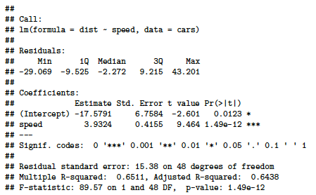
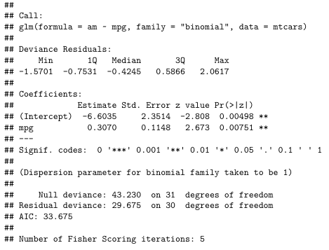

# Bivariate Analysis

 

 

 

## Correlation

We will now point our imaginary boat towards the Relationship Islands.
When we see one thing vary, we perceive it changing in some regard, as
the sun setting, the price of goods increasing, or the alternation of
green and red lights at an intersection. Therefore, when two things
covary there are two possibilities. One is that the change in the first
is concomitant with the change in the second, as the change in a child's
age covaries with his height. The older, the taller. When higher
magnitudes on one thing occur along with higher magnitudes on another
and the lower magnitudes on both also co-occur, then the things vary
together positively, and we denote this situation as positive
covariation or **positive correlation**. The second possibility is that
two things vary inversely or oppositely. That is, the higher magnitudes
of one thing go along with the lower magnitudes of the other and vice
versa. Then, we denote this situation as negative covariation or
**negative correlation**. This seems clear enough, but in order to be
more systematic about correlation more definition is needed.

We start with the concept of **covariance**, which represents the
direction of the linear relationship between two variables. By direction
we mean if the variables are directly proportional or inversely
proportional to each other. Thus, if increasing the value of one
variable we have a positive or a negative impact on the value of the
other variable. The values of covariance can be any number between the
two opposite infinities. It's important to mention that the covariance
only [measures the direction of the relationship between two variables
and not its magnitude]{.underline}, for which the correlation is used.

```{r, eval=F}
# simple covariance
cov(mtcars$hp, mtcars$mpg)
```

In probability theory and statistics, **correlation**, also called
correlation coefficient, indicates the strength and direction of a
linear relationship between two random variables [@davis2021;
@madhavan2019; @wilson2014]. In general statistical usage, correlation
or co-relation refers to the departure of two variables from
independence. In this broad sense there are several coefficients,
measuring the degree of correlation, adapted to the nature of data. The
best known is the **Pearson** product-moment correlation coefficient
($\rho$), which is used for linearly related variables and is obtained
by dividing the covariance of the two variables ($\sigma_{xy}$) by the
product of their standard deviations (Equation \@ref(eq:pears).

\begin{equation}
\rho=\frac{\sigma_{xy}}{\sigma_x*\sigma_y}
(\#eq:pears)
\end{equation}


A second measure is the **Spearman**'s rank correlation coefficient
($\rho_{R(x),R(y)}$) which is a nonparametric measure of rank
correlation defined as the Pearson correlation coefficient between rank
variables (Equation \@ref(eq:spear)).


\begin{equation}
\rho_{R(x),R(y)}=\frac{cov{(R(x),R(y))}}{\sigma_{R(x)}*\sigma_{R(y)}}
(\#eq:spear)
\end{equation}


While Pearson's correlation assesses linear relationships, Spearman's
correlation assesses monotonic relationships (whether linear or not). It
is, thus, fundamental a theoretical assumption taken before choosing the
right measure. Two variables $x$ and $y$ are positively correlated if
when $x$ increases $y$ increases too and when $x$ decreases $y$
decreases too. The correlation is instead negative when the variable $x$
increases and the variable $y$ decreases and vice-versa. The sign of
$\rho$ depends only on the covariance ($\sigma_{xy}$). The correlation
coefficient varies between -1 (perfect negative linear correlation) and
1 (perfect positive linear correlation), and if it is equal to zero the
variables are independent.

The code below allows you to compute the correlation coefficient between
two variables, and then a correlation matrix, which is a table showing
the correlation coefficients between each pair of variables. *Note that
the first line of code suppresses the scientific notation, allowing the
results of the future calculation to be expressed in decimals even if
they are really really small (or big) values.*

```{r, eval=F}
# suppress scientific notation
options(scipen = 9999)

# Correlation coefficients
cor(mtcars$mpg, mtcars$disp, method = "pearson")
cor(mtcars$mpg, mtcars$disp, method = "spearman")

# Pearson correlation matrix
cor(mtcars)
```

Because a correlation matrix may result dispersive and difficult to
study, especially when we have a high number of variables, there is the
possibility to visualize it. In fact, if the variables are correlated,
the "scatter" points have a trend very known: if the trend is linear the
correlation is linear.

The code below provides you with some examples. The function `pairs()`
is internal to R and gives us the most basic graph, while the function
`corrplot()` belongs to the `corrplot` package and provides a more
stylish and customizable graph [@wei2021]. Finally, the most interesting
(but advanced) version of a pair plot is offered by the `GGally` package
with the function `ggpairs()`[@emerson2012]. This function allows us to
draw a correlation matrix that can include whatever kind of value or
graph we want inside of each cell.

```{r, eval=F}
# basic pair plot
pairs(cars)

# the corrplot version
library(corrplot)
corrplot(cor(cars))

# the ggally version
library(GGally)
ggpairs(cars)
```

The last measure of relationship we will talk about is the **chi-squared
test** (also known as $\chi^2$ test). This is a hypothesis test
statistics that comes into play when dealing with contingency tables and
relatively large sample sizes. In simpler terms, the chi-squared test is
primarily employed to assess whether there's a relationship between two
[categorical variables]{.underline} in terms of their impact on the test
statistic. The purpose of the test is to evaluate how likely the
observed frequencies would be assuming the null hypothesis ($H_0$) is
true. Test statistics that follow a $\chi^2$ distribution occur when the
observations are independent.

```{r, eval=F}
# H0: The two variables are independent.
# H1: The two variables relate to each other.
chisq.test(mtcars$cyl, mtcars$am)

```

The code above computes the $\chi^2$ test for the number of cilinders of
a car and the presence of manual transmission. Since we get a p-Value
less than the significance level of 0.05, we reject the null hypothesis
and conclude that the two variables are in fact dependent.

**Cramér's V** (sometimes referred to as Cramer's $\phi$). This is a
measure of association between two categorical variables (or
categorical) based on Pearson's $\chi^2$ statistic and it was published
by Harald Cramér in 1946. Cramér's V, gives us a method that can be used
when we want to study the intercorrelation between two discrete
variables, and may be used with variables having two or more levels. It
varies from 0 (corresponding to no association between the variables) to
1 (complete association) and can reach 1 only when each variable is
completely determined by the other. Thus [it does not tell us the
direction of the association]{.underline}.

```{r, eval=F}
library(DescTools)
CramerV(mtcars$cyl, mtcars$am)
```

 

 

 

## Linear Regression

Linear regression examines the relation of a dependent variable
(response variable) to specified independent variables (explanatory
variables). The mathematical model of their relationship is the
regression equation. The dependent variable is modelled as a random
variable because of uncertainty as to its value, given only the value of
each independent variable. A regression equation contains estimates of
one or more hypothesized regression parameters ("constants"). These
estimates are constructed using data for the variables, such as from a
sample. The estimates measure the relationship between the dependent
variable and each of the independent variables. They also allow
estimating the value of the dependent variable for a given value of each
respective independent variable.

Uses of regression include curve fitting, prediction (including
forecasting of time-series data), modelling of causal relationships, and
testing scientific hypotheses about relationships between variables.
However, we must always keep in mind that a **correlation does not imply
causation**. In fact, the study of causality is as concerned with the
study of potential causal mechanisms as it is with variation amongst the
data [@Imbens2015].

The difference between correlation and regression is that whether in the
first $x$ and $y$ are on the same level, in the latter one $x$ affect
$y$, but not the other way around. This has important theoretical
implications in the selection of $x$ and $y$. The general form of a
**simple linear regression** is \@ref(eq:slr):


\begin{equation}
y=\beta_0+\beta_1x+e
(\#eq:slr)
\end{equation}


where $\beta_0$ is the intercept, $\beta_1$ is the slope, and$e$ is the
error term, which picks up the unpredictable part of the dependent
variable $y$. We will sometimes describe 1.1 by saying that we are
regressing $y$ on $x$. The error term $e$ is usually posited to be
normally distributed. The $x$'s and $y$'s are the data quantities from
the sample or population in question, and $\beta_0$ and $\beta_1$ are
the unknown parameters ("constants") to be estimated from the data.
Estimates for the values of $\beta_0$ and $\beta_1$ can be derived by
the method of [ordinary least squares]{.underline}. The method is called
"least squares", because estimates of $\beta_0$ and $\beta_1$ minimize
the sum of squared error estimates for the given data set (Equation \@ref(eq:rss)), thus
minimizing:


\begin{equation}
RSS=e_1^2+e_2^2+...+e_n^2
(\#eq:rss)
\end{equation}


The estimates are often denoted by $\hat\beta_0$ and $\hat\beta_1$ or
their corresponding Roman letters. It can be shown that least squares
estimates are given by 

\begin{equation}
\hat\beta_1=\frac{\sum_{i=1}^N(x_i-\bar{x})(y_i-\bar{y})}{\sum_{i=1}^N(x_i-\bar{x})^2} \\
\hat\beta_0=\bar{y}-\hat\beta_1 \bar{x}
\end{equation}

where $\bar{x}$ is the mean (average) of the $x$ values and $\bar{y}$
is the mean of the $y$ values.

```{r, echo=F, warning=F, out.width='50%', fig.align="center", fig.show='hold', fig.cap="Plot of the residuals from a regression line."}
d <- cars
fit <- lm(dist ~ speed, data = cars)
d$predicted <- predict(fit)   # Save the predicted values
d$residuals <- residuals(fit) # Save the residual values
library(ggplot2)
ggplot(d, aes(x = speed, y = dist)) +
  geom_smooth(method = "lm", se = FALSE, formula = y ~ x) +     # regression line  
  geom_segment(aes(xend = speed, yend = predicted), alpha = .2) + #connection line 
  geom_point() +
  geom_point(aes(y = predicted), shape = 1) +
  theme_bw()
```

As we said, before building our first regression model, it is important
to have an idea about the theoretical relationship between the variable
we want to study. In the case of the dataset `cars`, we know that speed
has an impact on the breaking distance of a car (variable dist) from our
physics studies. We can thus say that dist is our dependent variable
($y$), and speed is our independent variable ($x$).

We can fit the model in the following way. Inside the `lm()` function
place the dependent variable \~ independent variable, comma the dataset
in which they are contained. *Note that the formula 1.1 in the `lm()`
function is written as `y ~ x`.*[^6] The code chunk below draws a
summary and the plot of the relationship between the speed of a car and
the breaking distance.

[^6]: In order to type the symbol \~ (tilde) it is needed a different
    combination of keys according to the operating system and the
    keyboards.

```{r, eval=F}
# linear regression
fit <- lm(dist ~ speed, data = cars)
summary(fit)

library(ggplot2)
ggplot(cars, aes(dist, speed))+
        geom_point(size=3)+
        geom_smooth(method="lm")
```

The output of the summary of our regression model (Figure 15) must be
read in the following way in order to have a brief idea on the model
that we built. The first step is to look at the Multiple R-squared, this
number tells us which percentage of the data is explained by the model
(65.1% in this case), and thus how significant our model is. If the
model has an appreciable power to explain our data, we then analyze the
coefficients' estimates and their significance level. We see here that
speed has a p-value lower than 0.001 (thus highly significant[^7]) and
that one unit increase in speed means 3.9 units of increase in distance.
However, there is also a slightly significant intercept, $\beta_0$,
which means that there are factors which are not present in the model
and that could further explain the behavior of our dependent variable.
From a theoretical perspective this makes sense, in fact, the type of
tires, the weight of the car, the weather conditions (etc..) are some
additional factors that are missing in our model and could improve our
understanding of the phenomenon.

[^7]: For a discussion on the meaning of p-value go back to the previous
    chapter.

```{r, echo=F, out.width="50%",fig.align="center", fig.show="hold", fig.cap="Linear regression model summary output."}

```

Whether simple linear regression is a useful approach for predicting a
response on the basis of one single independent variable, we often have
more than one independent variable ($x$) that influence the dependent
variable ($y$). Instead of fitting a separate simple linear regression
model for each $x$, a better approach is to extend the simple linear
regression model. We can do this by giving each independent variable
($x$) a separate slope coefficient in a single model. In general,
suppose that we have $p$ distinct independent variables ($x$). Then the
**multiple linear regression model** takes the form \@ref(eq:mlr):


\begin{equation}
y\approx\beta_0+\beta_1x_1+\beta_2x_2...+\beta_px_p+e
(\#eq:mlr)
\end{equation}


where $x_p$ represents the $p^{th}$ independent variable, and $\beta_p$
quantifies the association between that variable and the dependent
variable $y$. We interpret $\beta_p$ as the average effect on $y$ of a
one unit increase in $x_p$, [holding all other independent variables
fixed]{.underline}. In other words, we will still have the effect of the
increase of one independent variable ($x$) over our dependent variable
($y$), but "controlling" for other factors.

In order to include more independent variables into our model, we use
the plus sign. The formula in R will then be `y ~ x1 + x2 + x3`. If we
want to use all the variables present in our dataset as independent
variables, the formula in R will be `y ~ .` where the dot stands for
"everything else". Another possibility is to have an interaction term.
An interaction effect exists when the effect of an independent variable
on a dependent variable changes, depending on the value(s) of one or
more other independent variables (i.e. $y=x*z$). However, interaction
terms are out of the scope of this manual.

To make an example, we can use the dataset `swiss`, which reports Swiss
fertility and socioeconomic data from the year 1888. Following some
models with a different number of variables used.

```{r, eval=F}
# multiple linear regression
fit2 <- lm(Fertility ~ ., data = swiss)
summary(fit2)

fit3 <- lm(Fertility ~ Education + Agriculture, data = swiss)
summary(fit3)
```

When we perform multiple linear regression, we are usually interested in
answering a few important questions in order to reach our goal: find the
model, with the lower number of independent variables that best explains
the outcome. The questions are:

1.  Is at least one of the $x_1, x_2, . . . ,x_p$ useful in explaining
    the independent variable $y$?

2.  Do all the $x_1, x_2, . . . ,x_p$ help to explain $y$, or is only a
    subset of them sufficient?

3.  How well does the model fit the data?

In order to answer the questions above we need to do a comparative
analysis between the models. Analysis of Variance (**ANOVA**) consists
of calculations that provide information about levels of variability
within a regression model and form a basis for tests of significance. We
can thus use the function `anova()` in order to compare multiple
regression models. When ANOVA is applied in practice, it actually
becomes a variable selection method: if the full model is significantly
different (null hypothesis rejected), the variable/s added by the full
model is/are considered useful for prediction. *Statistic textbooks
generally recommend to test every predictor for significance.*

```{r, eval=F}
# ANOVA testing
anova(fit2, fit3)
```

 

 

 

## Logistic Regressions

Whether independent variables can be either continuous or categorical,
if our dependent variable that is logical (1,0 or TRUE,FALSE), we will
have to run a different kind of regression model: the logistic model (or
logit model). This model gives us the probability of one event (out of
two alternatives) taking place by having the log-odds (the logarithm of
the odds) for the event be a linear combination of one or more
independent variables.

Using the `glm()` function (Generalized Linear Models), and the argument
`family="binomial"`, we can fit our logistic regression model.

```{r, eval=F}
fit4 <- glm(am ~ mpg, family="binomial", mtcars)
summary(fit4)
```

Its output (Figure 17) must be interpreted as follows. An increase in
miles per gallons (mpg) increases the probability that the car has
automatic transmission by 31%, and this increase is statistically
significant (p-value\<0.01). In this case we do not have the Multiple
R-squared to assess the significance of the model, but we will have to
look at the Residual deviance **tells us how well the response variable
can be predicted by a model with p predictor variables**. The lower the
value, the better the model is able to predict the value of the response
variable.

```{r, echo=F, out.width="50%",fig.align="center", fig.show="hold", fig.cap="Logistic regression model summary output."}

```

 

 

 

## Exercises

-   James, G., Witten, D., Hastie, T., & Tibshirani, R. (2021). An
    Introduction to Statistical Learning (Vol. 103). Springer New York.
    [Available here](https://www.statlearning.com). Chapter 3.6 and 3.7
    exercises from 8 to 15.

-   [R playground](https://federicoroscioli.shinyapps.io/exercises/),
    section 7 - T-tests and Regressions

\newpage

