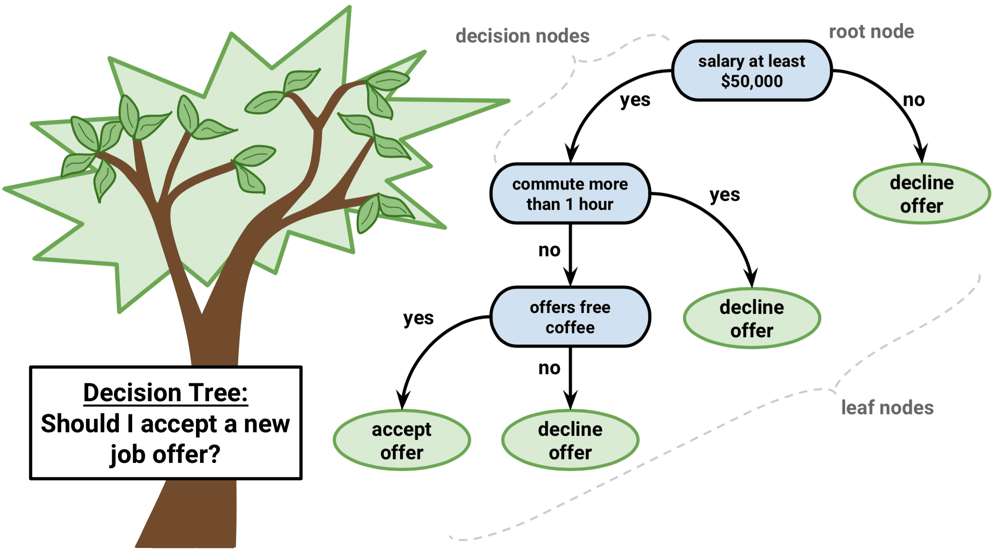

# Multivariate Analysis

Often bivariate analysis is not enough, and this is particularly true in
this historical period, when data availability is not an issue anymore.
One of the most common problems instead is how to analyze big (huge)
dataset. Multivariate analysis methods give us the possibility to
somehow reduce the dimensionality of the data, allowing a clearer
understanding of the relationships present in it.

 

 

 

## Cluster Analysis

Cluster analysis is an exploratory data analysis tool for solving
classification problems. Its objective is to sort observations into
groups, or clusters, so that the degree of association is strong between
members of the same cluster and weak between members of different
clusters. Each cluster thus describes, in terms of the data collected,
the class to which its members belong; and this description may be
abstracted through use from the particular to the general class or type.
Cluster analysis is thus a tool of discovery. It may reveal associations
and structure in data which, though not previously evident, nevertheless
are sensible and useful once found. The results of cluster analysis may
contribute to the definition of a formal classification scheme, such as
a taxonomy for related animals, insects or plants; or suggest
statistical models with which to describe populations; or indicate rules
for assigning new cases to classes for identification and diagnostic
purposes; or provide measures of definition, size and change in what
previously were only broad concepts; or find exemplars to represent
classes. Whatever business you're in, the chances are that sooner or
later you will run into a classification problem.

Cluster analysis includes a broad suite of techniques designed to find
groups of similar items within a data set. Partitioning methods divide
the data set into a number of groups predesignated by the user.
Hierarchical cluster methods produce a hierarchy of clusters from small
clusters of very similar items to large clusters that include more
dissimilar items [@abdi2010]. Both clustering and PCA seek to simplify
the data via a small number of summaries, but their mechanisms are
different: PCA looks to find a low-dimensional representation of the
observations that explain a good fraction of the variance; clustering
looks to find homogeneous subgroups among the observations.

As mentioned, when we cluster the observations of a data set, we seek to
partition them into distinct groups so that the observations within each
group are quite similar to each other, while observations in different
groups are quite different from each other. Of course, to make this
concrete, we must define what it means for two or more observations to
be similar or different.

In order to define the similarity between observations we need a
"metric". The Eucludean distance is the most common metric used in
cluster analysis, but many others exist (see the help in the `dist()`
function for more detail). We also need to choose which algorithm we
want to apply in order for the computer to assign the observations to
the right cluster.

Remember that Clustering has to be performed on [continuous scaled
data]{.underline}. If the variables you want to analyze are categorical,
you should use scaled dummies.

 

### Hierarchical Clustering

Hierarchical methods usually produce a graphical output known as a
dendrogram or tree that shows this hierarchical clustering structure.
Some hierarchical methods are divisive, that progressively divide the
one large cluster comprising all of the data into two smaller clusters
and repeat this process until all clusters have been divided. Other
hierarchical methods are agglomerative and work in the opposite
direction by first finding the clusters of the most similar items and
progressively adding less similar items until all items have been
included into a single large cluster. Hierarchical methods are
particularly useful in that they are not limited to a predetermined
number of clusters and can display similarity of samples across a wide
range of scales.

Bottom-up or agglomerative clustering is the most common type of
hierarchical clustering, and refers to the fact that a dendrogram is
built starting from the leaves and combining clusters up to the trunk.
As we move up the tree, some leaves begin to fuse into branches. These
correspond to observations that are similar to each other. As we move
higher up the tree, branches themselves fuse, either with leaves or
other branches. The earlier (lower in the tree) fusions occur, the more
similar the groups of observations are to each other. On the other hand,
observations that fuse later (near the top of the tree) can be quite
different. **The height of this fusion, as measured on the vertical
axis, indicates how different the two observations are.**

Hierarchical clustering allows also to select the method you want to
apply. *Ward's* minimum variance method aims at finding compact,
spherical clusters. The *complete linkage* method finds similar
clusters. The *single linkage* method (which is closely related to the
minimal spanning tree) adopts a 'friends of friends' clustering
strategy. The other methods can be regarded as aiming for clusters with
characteristics somewhere between the single and complete link methods.

The first step in order to proceed with hierarchical cluster analysis is
to compute the "distance matrix", which represents how distance are the
observations among themselves. For this step, as mentioned before, the
Euclidean distance is one of the most common metrics used. We then
properly run the hierarchical cluster analysis (function `hclust()`)
specifying the method for complete linkage. Finally we plot the
dendogram. *It is important that each row of the dataset has a name
assigned (see [Row Names])*.

```{r fig2, out.width="100%", fig.show='hold', fig.cap="Dendogram plot."}
# Euclidean distance
dist <- dist(swiss, method="euclidean")
# Hierarchical Clustering with hclust
hc <- hclust(dist, method="complete")
# Plot the result
plot(hc, hang=-1, cex=.5)
rect.hclust(hc, k=3, border="red")
```

The last line of code adds the rectangles highlighting 3 clusters. The
number of cluster is a personal choice, there is no strict rule about
how to identify them. The common rule of thumb is to look at the height
(vertical axes of the dendogram) and cut it where the highest jump
occurs between the branches. In this case it corresponds to 3 clusters.

Because of its agglomerative nature, clusters are sensitive to the order
in which samples join, which can cause samples to join a grouping to
which it does not actually belong. In other words, if groups are known
beforehand, those same groupings may not be produced from cluster
analysis. Cluster analysis is sensitive to both the distance metric
selected and the criterion for determining the order of clustering.
Different approaches may yield different results. Consequently, the
distance metric and clustering criterion should be chosen carefully. The
results should also be compared to analyses based on different metrics
and clustering criteria, or to an ordination, to determine the
robustness of the results.Caution should be used when defining groups
based on cluster analysis, particularly if long stems are not present.
Even if the data form a cloud in multivariate space, cluster analysis
will still form clusters, although they may not be meaningful or natural
groups. Again, it is generally wise to compare a cluster analysis to an
ordination to evaluate the distinctness of the groups in multivariate
space. *Transformations may be needed to put samples and variables on
comparable scales; otherwise, clustering may reflect sample size or be
dominated by variables with large values.*

 

### K-Means clustering

K-means clustering is a simple and elegant approach for partitioning a
data set into K distinct, non-overlapping clusters. To perform K-means
clustering, we must [first specify the desired number of clusters
K]{.underline}; then the K-means algorithm assigns each observation to
exactly one of the K clusters. The idea behind K-means clustering is
that a good clustering is one for which the within-cluster variation is
as small as possible. The K-Means algorithm, in an iteratively way,
defines a centroid for each cluster, which is a point (imaginary or
real) at the center of a cluster, and adjusts it until there is no
possible change anymore. The metric used is the Squared Sum of Euclidean
distances. [The main limitation of K-means is understanding which is the
right k prior to the analysis]{.underline}. Also, K-means is an
algorithm that tends to perform well only with spherical clusters, as it
looks for centroids.

The function `kmeans()` allows to run K-Means clustering given the
preferred number of clusters (centers). The results can be appreciated
by plotting the clusters using the `fviz_cluster()` function from the
package factoextra [@kassambara]. *Note that in order to plot the
clusters from K-means the function automatically reduces the
dimensionality of the data via PCA and selects the first two
components.*

```{r fig3, out.width="80%", fig.align="center", fig.show='hold', fig.cap="K-means clustering."}
# calculate the k-means for the preferred number of clusters
kc <- kmeans(swiss, centers=3)
library(factoextra) 
fviz_cluster(list(data=swiss, cluster=kc$cluster))
```

 

### The silhouette plot

Silhouette analysis can be used to study the separation distance between
the resulting clusters. This analysis is usually carried out prior to
any clustering algorithm [@syakur2018]. In fact, the silhouette plot
displays a measure of how close each point in one cluster is to points
in the neighboring clusters and thus provides a way to assess parameters
like number of clusters visually. This measure has a range of $-1, 1$.
The value of *k* that maximizes the silhouette width is the one
minimizing the distance within the clusters and maximizing the distance
between them. However, it is important to remark that [the silhouette
plot analysis provides just a rule of thumb for cluster
selection]{.underline}.

In the case of the `swiss` dataset, the silhouette plot suggests the
presence of only two clusters both using hierarchical clustering and
K-Means. As we have seen previously this is not properly true.

```{r fig4, out.width=c('50%', '50%'), fig.show='hold', fig.cap="From left: Hierarchical clustering silhouette plot; K-means clustering silhouette plot."}
#silhouette method
library(factoextra) 
fviz_nbclust(swiss, FUN = hcut)
fviz_nbclust(swiss, FUN = kmeans)
```

 

 

 

## Heatmap

A Heatmap is a two-way display of a data matrix in which the individual
cells are displayed as colored rectangles. The color of a cell is
proportional to its position along a color gradient. Usually, the
columns (variables) of the matrix are shown as the columns of the heat
map and the rows of the matrix are shown as the rows of the heat map, as
in the example below. The order of the rows is determined by performing
hierarchical cluster analyses of the rows (it is even possible to
appreciate the corresponding dendogram on the side of the heatmap). This
tends to position similar rows together on the plot. The order of the
columns is determined similarly. Usually, a clustered Heatmap is made on
variables that have similar scales, such as scores on tests. If the
variables have different scales, the data matrix must first be scaled
using a standardization transformation such as z-scores or proportion of
the range.

In the heatmap you can see that V. of Geneve is a proper outlier in
terms of Education and share of people involved in the agricultural
sector. For more advanced Heatmaps, please [visit this link.](https://www.datanovia.com/en/lessons/heatmap-in-r-static-and-interactive-visualization/)

```{r, fig.show='hold',out.width="80%", fig.align="center", fig.cap="Heatmap."}
#heatmap
dataMatrix <- as.matrix(swiss)
heatmap(dataMatrix, cexCol=.8)
```

 

 

 

## Principal Component Analysis

Principal Component Analysis (PCA) is a way of identifying patterns in
data, and expressing the data in such a way as to highlight their
similarities and differences [@abdi2010, @jolliffe2016]. Since patterns
in data can be hard to find in data of high dimension, where the luxury
of graphical representation is not available, PCA is a powerful tool for
analysing data. The other main advantage of PCA is that once we have
found these patterns in the data, we compress the data (ie. by reducing
the number of dimensions) without much loss of information.

[The goal of PCA is to reduce the dimensionality of the data while
retaining as much as possible of the variation present in the
dataset.]{.underline}

PCA is:

-   a statistical technique used to examine the interrelations among a
    set of variables in order to identify the underlying structure of
    those variables.
-   a non-parametric analysis and the answer is unique and independent
    of any hypothesis about data distribution.

These two properties can be regarded as weaknesses as well as strengths.
Since the technique is non-parametric, no prior knowledge can be
incorporated. Moreover, PCA data reduction often incurs a loss of
information.

The assumptions of PCA:

1.  [Linearity]{.underline}. Assumes the data set to be linear
    combinations of the variables.
2.  [The importance of mean and covariance]{.underline}. There is no
    guarantee that the directions of maximum variance will contain good
    features for discrimination.
3.  [That large variances have important dynamics]{.underline}. Assumes
    that components with larger variance correspond to interesting
    dynamics and lower ones correspond to noise.

The first principal component can equivalently be defined as a direction
that maximizes the variance of the projected data. The second will
represent the direction that maximizes the variance of the projected
data, given the first component, and thus it will be uncorrelated with
it. And so on for the other components. Once we have computed the
principal components, we can plot them against each other in order to
produce low-dimensional views of the data. More generally, we are
interested in knowing the proportion of variance explained by each
principal component and analyse the ones that maximize it.

It is important to remember that PCA has to be performed on [continuous
scaled data]{.underline}. If the variables we want to analyze are
categorical, we should use scaled dummies or correspondence analysis.
Another fundamental aspect is that each row of the dataset must have a
name assigned to it, otherwise we will not see the names corresponding
to each observation in the plot. See [Scaling data] and [Row Names] for
more information on the procedure.

Using the codes below, we are able to reduce the dimensionality in the
`swiss` dataset. This dataset presents only percentage values, thus all
the variables are already continuous and in the same scale. Moreover,
each observation (village) has its row named accordingly, so we do not
need to do any transformation prior to the analysis. One we are sure
about these two aspect, we can start our analysis by studying the
correlation between the different variables that compose the dataset. We
do so because we know the PCA works best when we have correlated
variables that can be "grouped" within the same principal component by
the algorithm.

```{r, eval=F}
# Correlation Matrix
cor(swiss)
```

The next step is to properly run the PCA's algorithm and assign it to an
object. If the values are not on the same scale, it is better to set the
argument scale equal to TRUE. This argument sets the PCA to work on the
correlation matrix, instead of on the covariance matrix, allowing to
start from values all centered around 0 and with the same scale. The
object created by `prcomp()` is a "list". A list can contain dataframes,
vectors, variables, etc... In order to explore what is inside of a list
you can use the `$` sign or the `[]` (nested square brackets). The
summary and the scree plot (command `fviz_eig()` from the package
`factoextra`) are the first thing to look at because they tell us how
much of the variance is explained by each component [@kassambara]. The
higher are the first components, the more accurate our PCA will be. In
this case, the first two components retain 73.1% of the total
variability within the data.

```{r, eval=F}
library(factoextra)
#running the PCA
pca_swiss <- prcomp(swiss, scale = TRUE)
summary(pca_swiss)

#visualizing the PCA
fviz_eig(pca_swiss)
```

```{r, echo=F, warning=F, out.width='80%', fig.align="center", fig.show='hold', fig.cap="Screeplot.", message=F}
library(factoextra)
#running the PCA
pca_swiss <- prcomp(swiss, scale = TRUE)

#visualizing the PCA
fviz_eig(pca_swiss)
```

The final step is to plot the graph of the variables, where positively
correlated variables point to the same side of the plot, while
negatively correlated variables point to opposite sides of the graph. We
can see how Education is positively correlated with the PC2, while
Fertility and Catholic are negatively correlated with the same dimension
and thus also with Education. This result confirms what we already saw
in the correlation matrix above.

The graph of individuals, instead, tells us how the observations (the
villages in this case) are related to the components. Thus, we can
conclude by saying that V. de Geneve has some peculiar characteristics
as compared with the other villages, in fact it has the highest
education level and lowest fertility and share of catholic people.

The biplot overlays the previous two graphs allowing a more immediate
interpretation. However if we have many variables and observations, this
plot can be do messy to be analyzed.

```{r, out.width=c('50%', '50%'), fig.show='hold', fig.cap="From top-left clockwise: Graph of variables, positive correlated variables point to the same side of the plot; Graph of individuals, individuals with a similar profile are grouped together; Biplot of individuals and variables.", message=F, warning=F}
# Graph of variables
fviz_pca_var(
        pca_swiss,
        col.var = "contrib",
        repel = TRUE     # Avoid text overlapping
)

# Graph of individuals
fviz_pca_ind(
        pca_swiss,
        col.ind = "cos2",
        repel = TRUE
)

# Biplot of individuals and variables
fviz_pca_biplot(pca_swiss, repel = TRUE)

```

As a robustness check, and also to better understand what the algorithm
does, we can compare the rotation of the axis before and after the pca
looking at the pairs plot. In the pair graph after the PCA we expect to
see no relationship between all the principal component, as this is the
aim of the PCA algorithm.

```{r,  fig.show='hold', fig.cap="From top: Pairs graph before PCA; Pairs graph after PCA.", message=F}
# Pairs before PCA
pairs(swiss, panel=panel.smooth, col="#6da7a7")

# Pair after PCA
pairs(pca_swiss$x, panel=panel.smooth, col="#6da7a7")

```

 

 

 

## Classification And Regression Trees

Classification and Regression Trees (CART) are simple and useful methods
for interpretation that allow to understand the underlying relationship
between one dependent variable and multiple independent variables
[@mahjoobi2008, @temkin1995]. As compared to multiple linear regression
analysis, this set of methods does not retrieve the impact of one
variable on the outcome controlling for a set of other independent
variables. It instead recursively looks at the most significant
relationship between a set of variables, subsets the given data
accordingly, and finally draws a tree. CART are a great tool for
communicating complex relationships thanks to their visual output,
however they have generally a poor predicting performance.

Depending on the dependent variable type it is possible to apply a
Classification (for discrete variables) or Regression (for continuous
variables) Tree. In order to build a **regression tree**, the algorithm
first uses recursive binary splitting to grow a large tree, stopping
only when each terminal node has fewer than some minimum number of
observations. Beginning at the top of the tree, it splits the data into
2 branches, creating a partition of 2 spaces. It then carries out this
particular split at the top of the tree multiple times and chooses the
split of the features that minimizes the Residual Sum of Squares (RSS).
Then it repeats the procedure for each subsequent split. A
**classification tree**, instead, is built by predicting which
observation belongs to the most commonly occurring class in the region
to which it belongs. However, in the classification setting, RSS cannot
be used as a criterion for making the binary splits. The algorithm then
uses Classification Error Rate, Gini Index or Cross-Entropy.

In interpreting the results of a classification tree, you are often
interested not only in the class prediction corresponding to a
particular terminal node region, but also in the class proportions among
the training observations that fall into that region. The image below
offers a clear understanding of how a classification tree must be read
[@lee2018]. We first state our research question. The answer proposed
depend on the variables included in our data. In this case we will
accept the new job offer only if the salary is higher than \$50k, it
takes less than one hour to commute, and the company offers free coffee.

```{r, echo=F, out.width="80%",fig.align="center", fig.show="hold", fig.cap="Classification tree explanation. Source Lee (2018)."}

```

The main question is when to stop splitting? Clearly, if all of the
elements in a node are of the same class it does not do us much good to
add another split. Doing so would usually decrease the power of our
model. This is known as [overfitting]{.underline}. As omniscient
statisticians, we have to be creative with the rules for termination. In
fact, there is no one-size-fits-all-rule in this case, but the algorithm
provides a number of parameters that we can set. This process is called
"pruning", as if we were pruning a tree to make it smaller and simpler.

**Manual pruning**, is performed starting from fully grown (over-fitted)
trees and setting parameters such as the minimum number of observations
that must exist in a node in order for a split to be attempted
(`minsplit`), the minimum number of observations in any terminal node
(`minbucket`), and the maximum depth of any node of the final tree, with
the root node counted as depth 0 (`maxdepth`), just to mention the most
important ones. There is no rule for setting these parameters, and here
comes the art of the statistician.

**Automatic pruning**, instead, is done by setting the complexity
parameter (`cp`). The complexity parameter is a combination of the size
of a tree and the ability of the tree to separate the classes of the
target variable. If the next best split in growing a tree does not
reduce the tree's overall complexity by a certain amount, then the
process is terminated. The complexity parameter by default is set to
0.01. Setting it to a negative amount ensures that the tree will be
fully grown. But which is the right value for the complexity parameter?
Also in this case, there is not a perfect rule. The rule of thumb is to
set it to zero, and then select the complexity parameter that minimizes
the level of the cross-validated error rate.

In our example below, we will use the dataset `ptitianic`, from the
package `rpart.plot`. The dataset provides a list of passengers on board
fo the famous ship Titanic which sank in the North Atlantic Ocean on 15
April 1912. It tells us whether the passenger died or survived, the
passenger class, gender, age, the number of sibling or spouses aboard,
and the number of parents or children aboard. Our aim is to understand
which were the factors allowing the passenger to survive.

The package `rpart` allows us to run the CART algorithms
[@therneau2022]. The `rpart()` function needs the specification of the
formula using the same syntax used for multiple linear regressions, the
source of data, and the method (if `y` is a survival object, then
`method = "exp"`, if `y` has 2 columns then `method = "poisson"`, if `y`
is categorical then `method = "class"`, otherwise `method = "anova"`).
In the code below, the argument `method = "class"` is used given that
the outcome variable is a categorical variable. *It is important to set
the seed before working with rpart if we want to have coherent results,
as it runs some random sampling.*

The `fit` object is a fully grown tree (`cp<0`). We then create `fit2`,
which is a tree manually pruned by setting the parameters mentioned
above. Remember that it is not required to set all the parameters, one
of them could be enough. Finally, `fit3` is and automatically pruned
tree. The functions `printcp(fit)` and `plotcp(fit)`, allow us to
visualize the cross-validated error rate of the fully grown tree
(`fit`), so that we can select the value for the complexity parameter
that will minimize that value. In this case, I would pick the "elbow" of
the graph, thus `cp=0.094`. In order to apply a new complexity parameter
to the fully grown tree, either we grow the tree again as done for
`fit`, or we use the function `prune.rpart()`.

We then plot the tree using `fancyRpartPlot()` from the package `rattle`
[@williams2011]. The graph produced displays the number of the node on
top of each node, the predicted class (yes or no), the number of
miss-classified observations, the percentage of observations in the
predicted class for this node. As we see here, in this case, pruning
using the automatic method retrieved a poor tree with only one split,
whether the manually pruned tree is richer and allows us to interpret
the result.

```{r, eval=F}
library(rpart)
library(rpart.plot)
library(rattle)

# set the seed in order to have replicability of the model
set.seed(123, kind = "Mersenne-Twister", normal.kind =  "Inversion")

# fully grown tree
fit <- rpart(
        as.factor(survived) ~ ., 
        data = ptitanic, 
        method = "class",
        cp=-1
)

# manually pruned tree
fit2 <- rpart(
        as.factor(survived) ~ ., 
        data = ptitanic, 
        method = "class",
        # min. n. of obs. that must exist in a node in order for a split 
        minsplit = 2, 
        # the minimum number of observations in any terminal node
        minbucket = 10, 
        # max number of splits
        maxdepth = 5
)

# automatically pruned tree
# printing and plotting the cross-validated error rate
printcp(fit)
plotcp(fit)

# pruning the tree accordingly by setting the cp=cpbest
fit3 <- prune.rpart(fit, cp=0.094)

# plotting the tree
fancyRpartPlot(fit2, caption = "Classification Tree for Titanic pruned manually")
fancyRpartPlot(fit3, caption = "Classification Tree for Titanic pruned automatically")

```

```{r,  echo = F, out.width=c('50%', '50%'), fig.show='hold', fig.cap="From left: Complexity vs X-val Relative Error; The automatically pruned CART.", message=F}
library(rpart)
library(rpart.plot)
library(rattle)

# set the seed in order to have replicability of the model
set.seed(123, kind = "Mersenne-Twister", normal.kind =  "Inversion")

# fully grown tree
fit <- rpart(
        as.factor(survived) ~ ., 
        data = ptitanic, 
        method = "class",
        cp=-1
)

# manually pruned tree
fit2 <- rpart(
        as.factor(survived) ~ ., 
        data = ptitanic, 
        method = "class",
        # min. n. of obs. that must exist in a node in order for a split 
        minsplit = 2, 
        # the minimum number of observations in any terminal node
        minbucket = 10, 
        # max number of splits
        maxdepth = 5
)

# automatically pruned tree
# printing and plotting the cross-validated error rate
plotcp(fit)

# pruning the tree accordingly by setting the cp=cpbest
fit3 <- prune.rpart(fit, cp=0.094)

# plotting the tree
fancyRpartPlot(fit3)
```

```{r, echo=F, fig.show='hold', out.width="80%", fig.align="center", fig.cap="The manually pruned CART.", message=F}
fancyRpartPlot(fit2)
```

If we want to give an interpretation of the manually pruned tree we can
say the following. The probability of dying on board of the Titanic were
about 83% if the passenger was a male, older than 9.5 years old, and
this happened for 61% of the passengers aboard. On the contrary, there
were 93% of chances of surviving by being a woman with a passenger class
different than the 3rd. This statistic applies to 19% of the passengers
abroad.

The algorithm for growing a decision tree is an example of recursive
partitioning. The recursive binary splitting approach is top-down and
greedy. Top-down because it begins at the top of the tree (at which
point all observations belong to a single "region") and then
successively splits the independent variable' space; each split is
indicated via two new branches further down on the tree. It is greedy
because at each step of the tree-building process, the best split in
terms of minimum RSS is made at that particular step, rather than
looking ahead and picking a split that will lead to a better tree in
some future step. Each node in the tree is grown using the same set of
rules as its parent node.

A much more powerful use of CART (but less interpretable) is when we
have an ensemble of them. An ensemble method is an approach that
combines many simple "building ensemble block" models (in this case
trees) in order to obtain a single and potentially very powerful model.
Some examples are Bagging, Random Forest, or Boosting. However, these
methodologies are out of the scope of this book.

 

 

 

## Composite Indicators

A composite indicator is formed when individual indicators are combined
into a single index, based on an underlying model of the
multidimensional concept that is being measured. The indicators that
make up a composite indicator are referred to as components or component
indicators, and their variability represents the implicit weight the
component has within the final composite indicator [@Otoiu2021,
@mazziotta2020]. One of the most common and advanced methods to build a
composite indicator is the use of a scoring system, which is a flexible
and easily interpretable measure [@joint2008handbook, @mazziotta2020].
It can be expressed as a relative or absolute measure, depending on the
method chosen, and, in both cases, the composite index can be compared
over time. Some examples are the Mazziotta-Pareto Index (relative
measure), the Adjusted Mazziotta-Pareto Index (absolute
measure)[@mazziotta2020], the arithmetic mean of the z-scores (relative
measure), or the arithmetic mean of Min-Max [@joint2008handbook]. Scores
can also be clustered or classified to have a ranking of regions.
Furthermore, a scoring system allows to use the components in its
original form, thus keeping the eventual weighting or balancing they
have. Finally, the reference value facilitates the interpretation of the
scores (i.e., a score of 90 given an average of 100 means that the
region is 10 points below the average). The only caveat we can find is
the lack of a unit of measure for the final indicator and thus the
impossibility to have a meaningful single value for the world
aggregation.

 

### Mazziotta-Pareto Index

The Mazziotta--Pareto index (MPI) is a composite index or summarizing a
set of individual indicators that are assumed to be not fully
substitutable. It is based on a non-linear function which, starting from
the arithmetic mean of the normalized indicators, introduces a penalty
for the units with unbalanced values of the indicators
[@de2011composite]. The MPI is the best solution for static analysis.

Given the matrix $Y=y_{ij}$ with $n$ rows (statistical units) and $m$
columns (individual indicators), we calculate the normalized matrix \@ref(eq:normmat)
$Z=z_{ij}$ as follows:

\begin{equation}
z_{ij}=100\pm\frac{y_{ij}-M_{y_j}}{S_{y_j}}*10
(\#eq:normmat)
\end{equation}

where $M_{y_j}$ and $S_{y_j}$ are, respectively, the mean and standard
deviation of the indicator $j$ and the sign $\pm$ is the 'polarity' of
the indicator $j$, i.e., the sign of the relation between the indicator
$j$ and the phenomenon to be measured ($+$ if the individual indicator
represents a dimension considered positive and $-$ if it represents a
dimension considered negative).

We then aggregate the normalized data. Denoting with
$M_{z_i},S_{z_i},cv_{z_i}$, respectively, the mean, standard deviation,
and coefficient of variation of the normalized values for the unit $i$,
the composite index is given by \@ref(eq:mpi): 
\begin{equation}
MPI^\pm_i= M_{z_i}*(i+cv^2_{z_i})=M_{z_i}\pm S_{z_i}*cv_{z_i}
(\#eq:mpi)
\end{equation}

where the sign $\pm$ depends on the kind of phenomenon to be
measured. If the composite index is 'increasing' or 'positive', i.e.,
increasing values of the index correspond to positive variations of the
phenomenon (e.g., socio-economic development), then $MPI^-$ is used. On
the contrary, if the composite index is 'decreasing' or 'negative',
i.e., increasing values of the index correspond to negative variations
of the phenomenon (e.g., poverty), then $MPI^+$ is used. In any cases,
an unbalance among indicators will have a negative effect on the value
of the index.

```{r, eval=F}
library(Compind)
# loading data
data(EU_NUTS1)

# inputting rownames
EU_NUTS1 <- data.frame(EU_NUTS1)
rownames(EU_NUTS1) <- EU_NUTS1$NUTS1

# Unsustainable Transport Index (NEG)

# Normalization (roads are negative, trains are positive)
data_norm <- normalise_ci(EU_NUTS1,c(2:3),
                          # roads are negative, railrads positive
                          polarity = c("NEG","POS"),
                          # z-score method
                          method = 1)

# Aggregation using MPI (the index is negative)
CI <- ci_mpi(data_norm$ci_norm, 
             penalty="NEG")

# Table containing Top 5 Unsustainable Transport Index
pander(data.frame(AMPI=head(sort(CI$ci_mpi_est, decreasing = T),5)), 
       caption = "Top 5 unsustainable Index")

# Table containing Bottom 5 Unsustainable Transport Index (aka most sustainable)
pander(data.frame(AMPI=sort(tail(sort(CI$ci_mpi_est, decreasing = T),5))), 
       caption = "Bottom 5 unsustainable Index")
```

In the example above, we usa a dataset present in the same Compind
package [@compind]. We first input the rownames (this is needed to have
the names of the countries in our final table), we then state the index
and its polarity. We normalize the data using the function
`normalise_ci` selecting the variables of interest, their polarity with
respect to the phenomeon of interest, and the method to use (see the
help for the available methods). We finally compute our MPI using the
function `ci_mpi` by specifying its penality.

 

### Adjusted Mazziotta-Pareto Index

In this study we consider as a composite indicator the Adjusted
Mazziotta Pareto Index (AMPI) methodology. AMPI is a non-compensatory
(or partially compensatory) composite index that allows the
comparability of data between units and over time
[@mazziotta2016generalized]. It is a variant of the MPI, based on a
rescaling of individual indicators using a Min-Max transformation
[@de2011composite].

To apply AMPI, the original indicators are normalized using a Min-Max
methodology with goalposts. As compared to the most common MPI, the
Min-Max normalization technique enables us to compare data over time,
whereas the z-score normalization used in MPI does not. Given the matrix
$X=\{x_{ij}\}$ with $n$ rows (units) and $m$ columns (indicators), we
calculate the normalized matrix $R=\{r_{ij}\}$ as follows \@ref(eq:normmat2):
\begin{equation}
r_{ij}=\frac{x_{ij} -\min x_j}{\max x_j - \min x_j} *60+70
(\#eq:normmat2)
\end{equation}

where $x_{ij}$ is the value of the indicator $j$ for the unit $i$ and
$\min x_j$ and $\max x_j$ are the 'goalposts' for the indicator $j$. If
the indicator $j$ has negative polarity, the complement of $(1)$ is
calculated with respect to $200$. To facilitate the interpretation of
results, the 'goalposts' can be fixed so that 100 represents a reference
value (e.g., the average in a given year). A simple procedure for
setting the 'goalposts' is the following. Let $\inf x_j$ and $\sup x_j$
be the overall minimum and maximum of the indicator $j$ across all units
and all time periods considered. Denoting with $\text{ref } x_j$ the
reference value for the indicator $j$, the 'goalposts' are defined as \@ref(eq:goals):

\begin{equation*}
    \begin{cases}
      \min x_j= \text{ref } x_j - (\sup x_j - \inf x_j)/2\\
      \max x_j= \text{ref } x_j + (\sup x_j - \inf x_j)/2
    \end{cases}\
(\#eq:goals)
\end{equation*} 
 
The normalized values will fall approximately in the range (70; 130),
where 100 represents the reference value.

The normalized indicators can then be aggregated. Denoting with
$M_{r_i}$ and $S_{r_i}$, respectively, the mean and standard deviation
of the normalized values of the unit $i$, the generalized form of AMPI
is given by \@ref(eq:ampi):

\begin{equation}
AMPI_i^{+/-}=M_{r_i} \pm S_{r_i}*cv_i
(\#eq:ampi)
\end{equation}

where $cv_i=\frac{S_{r_i}}{M_{r_i}}$ is the coefficient of variation of the
unit $i$ and the sign $\pm$ depends on the kind of phenomenon to be
measured. If the composite index is increasing or positive, that is,
increasing the index values corresponds to positive variations in the
phenomenon (for example, well-being), then $AMPI^-$ is used. Vice versa,
if the composite index is decreasing or negative, that is, increasing
index values correspond to negative variations of the phenomenon (e.g.
waste), then $AMPI^+$ is used. This approach is characterized by the use
of a function (the product $S_{r_i}*cv_i$) to penalize units with
unbalanced values of the normalized indicators. The 'penalty' is based
on the coefficient of variation and is zero if all values are equal. The
purpose is to favor the units that, mean being equal, have a greater
balance among the different indicators. Therefore, AMPI is characterized
by the combination of a 'mean effect' ($M_{r_i}$) and a 'penalty effect'
($S_{r_i}*cv_i$) where each unit stands in relation to the 'goalposts'.

```{r, eval=F}
# loading data
data(EU_2020)

# Sustainable Employment Index (POS)

# subsetting interesting variables
data_test <- EU_2020[,c("geo","employ_2010","employ_2011","finalenergy_2010",
                        "finalenergy_2011")] 

# reshaping to long format
EU_2020_long <- reshape(data_test, 
                       #our variables
                      varying=c(2:5), 
                      direction="long", 
                      #geographic variable
                      idvar="geo", 
                      sep="_")

# normalization and aggregation using AMPI
CI <- ci_ampi(EU_2020_long, 
              #our variables
              indic_col=c(3:4),
              #goalposts
              gp=c(50, 100), 
              #time variable
              time=EU_2020_long$time,
              #both variables are positive
              polarity= c("POS", "POS"),
              #index is positive
              penalty="POS")

# Table containing the Sustainable Employment Index scores
pander(data.frame(t(CI$ci_ampi_est)), caption = "AMPI time series")
```

In the example above, we usa a dataset present in the same Compind
package [@compind]. We reshape data to long format, allowing us to have
a dataset with one variable per column. We then use the function
`ci_ampi` which standardize the data and compite the score at the same
time. In this function we set the dataset, the variables of interest,
the values of the corresponding variables to be used as a reference
(goalposts), the time variable, the polarity of the variables and the
penality corresponding to the final indicator.

 

 

 

## Exercises

-   [R playground](https://federicoroscioli.shinyapps.io/exercises/),
    section 6 - PCA and Clustering


-   [R playground](https://federicoroscioli.shinyapps.io/exercises/),
    section 8 - Classification And Regression Trees

\newpage

<!-- # Spatial Analysis -->

<!-- To be done... -->

# Final Remarks {.unnumbered}

At this point I expect that you are familiar with the *Rish* language
and its dynamics. This manual covered some basic data analysis methods,
but there is much more to do and to learn. Now it is your time to
explore new packages, new ways of writing code, and new statistical
techniques.

Be curious and have fun!

*Federico Roscioli*

\newpage

# Bibliography {.unnumbered}